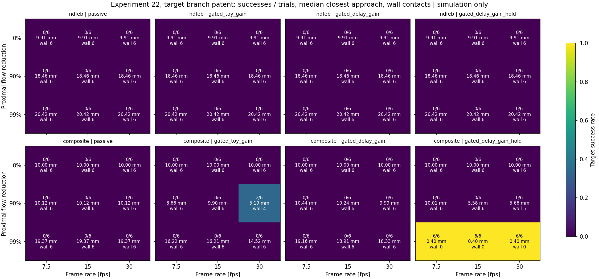
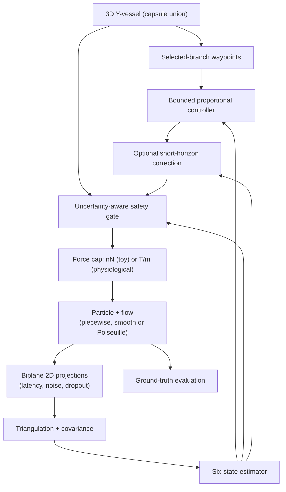

# Safe Magnetic Microrobot Navigation

**Closed-loop magnetic steering of a microrobot through a 3D vessel bifurcation,
under delayed, noisy and intermittent imaging.**

A simulation-first research platform. A magnetized sphere must reach a selected
branch of a Y-shaped vessel while keeping clear of the wall, using only biplane
2D observations that arrive late, carry noise and sometimes drop out.

> **Computational research and education only.** There is no clinical device
> design, no animal or human protocol, and no claim of clinical validity or
> efficacy. Every parameter is either sourced or explicitly marked *assumed*.

## Where the project stands

The first phase (experiments **01–20**) built the full navigation stack on a
deliberately slow **toy plant**: 0.6 mm/s flow and a 3 nN force cap. The
analytical feasibility study ([docs/14](docs/14_feasibility.md)) then asked
what changes at **real cerebral scale** (M1 artery, ~0.3 m/s mean flow):

- With a ~1 T/m clinical electromagnetic system, worst-case steering needs a
  particle radius of about 80 µm or more. That is exactly where the overdamped
  Stokes model used so far stops being valid (Stokes number > 0.1).
- Pure NdFeB needs 0.063 T/m just to hold against gravity. Clinical MRI
  imaging gradients (0.02–0.04 T/m) cannot do that.
- Reducing proximal flow widens the feasible window far more than a stronger
  gradient does.

**Step 2 (complete)** moved the simulator itself to physiological scale.
Real-scale physics is added as opt-in options. The toy defaults stay
unchanged so experiments 01–20 remain exactly reproducible.

| Stage | Content | Status |
|---|---|---|
| 2a | Force cap in T/m from gradient × magnetization × volume; configurable radius and material | ✅ |
| 2b | Poiseuille velocity profile; timestep shrinks automatically with speed | ✅ |
| 2c | Particle inertia (reduced Maxey–Riley, added mass, finite-Re drag) | ✅ |
| 2d | Pulsatile flow with release phase, Womersley number, optional fluid-acceleration force | ✅ |
| 2e | Gravity on the plant, diagnostic sedimentation check, opt-in gravity compensation | ✅ |
| 2f | `physiological` preset, occluded branch, zero-order-hold actuation, gain from force cap, closest-approach metric, sweep experiment 22 | ✅ |

**Headline result** ([docs/15](docs/15_physiological_sweep.md), 864 trials):

- **Pure NdFeB never reaches a frame.** A 100 µm pure NdFeB sphere settles to
  the wall within 47 ms, before the first frame arrives: 0/432.
- **Without flow reduction nothing succeeds.** At full M1 flow every trial ends
  against the wall within ~44 ms.
- **One combination works.** A light composite particle at 99% proximal flow
  reduction, with a delay-limited gain and gravity hold, reaches a patent
  target in 18/18 trials at 7.5–30 fps. The same combination fails every time
  without the hold, or with the toy-equivalent gain, which overshoots on stale
  estimates.
- **An occluded target is never reached:** 0/432.

In this controller, the feedback authority is limited by imaging delay, so
flow reduction matters more than gradient strength.

**Delay-aware control** ([docs/16](docs/16_delay_aware_control.md), experiment
23, held-out seeds). A command-aware (Smith-predictor-like) estimator lets the
gain be set by the 10 ms actuation period instead of the imaging delay.

- At 99% flow reduction it reaches **occluded targets in 18/18** trials
  (baseline 1/18). The result holds under ±20% drag-model error.
- It reaches patent targets in a median 0.79 s instead of 2.78 s.
  ([Animation of one occluded cell, P0 against P2](docs/figures/steering_occluded_p0_vs_p2.gif))
- 90% reduction stays mostly out of reach (best 5/18).
- The existing wall-prediction filter regresses at 7.5 fps.
- Estimated-flow feedforward adds nothing measurable.

**Model feedforward and release hold** ([docs/17](docs/17_feedforward_and_hold.md),
experiment 24, held-out seeds):

- **Pure NdFeB now works at 99% reduction.** Holding against the known weight
  from release lets it reach patent and occluded targets in 18/18 trials each;
  in experiment 22 it was 0/432.
- **Model flow feedforward opens up 90% reduction, but only with an accurate
  flow model.** With a correct model, the particle reaches occluded targets in
  8/18 (composite) and 11/18 (pure NdFeB) trials, against a baseline of 0/18.
  It needs at least 15 fps; every 7.5 fps cell fails. A ±20% error in the flow
  model removes most of the gain.
- **Two smaller findings.** A 50 ms wall-prediction horizon removes the 7.5 fps
  regression but adds nothing. The command-aware estimator had been treating a
  held weight as motion; the fix is opt-in (`estimator_knows_weight`).

**Flow-model errors** ([docs/18](docs/18_flow_model_errors.md), experiment 25,
held-out seeds). The 90%-reduction result is fragile:

- Cardiac timing errors up to 0.1 period are tolerable (27/72 against 32/72 exact).
- A 20–25% bias in speed or profile, a wrong pulsation amplitude, or a phase
  error of 0.25 period or more removes most or all of the benefit.
- Errors in where the flow turns at the split are tiny on average but can swing
  occluded-target success from 19/36 to 0/36 or 22/36, depending on their direction.
- At 99% reduction every condition stays at 72/72.

**Measured flow map** ([docs/19](docs/19_measured_flow_map.md), experiment 26,
held-out seeds). The controller uses a voxelized, noisy map of the flow
(4D-flow-MRI-like; resolution and noise assumed) instead of the analytic model.

- A map of 0.25–0.5 mm keeps the full 90% feedforward benefit: 38–41/72 against
  32/72 for the exact model, with overlapping intervals.
- 5% noise costs little (35/72) and 10% noise halves it (20/72).
- A 1.0 mm map blurs the split and loses occluded targets entirely (8/72 overall).
- At 99% even the worst map gives 72/72.

**Robustness of the 99% operating point** ([docs/20](docs/20_operating_point_robustness.md),
experiment 28, held-out seeds).

- **Unaffected (72/72):** latency up to 0.1 s, gradients down to 0.25 T/m,
  1 px calibration error and 3 px detector noise.
- **Losses:**
  - 0.2 s latency: 59/72.
  - ±20% actuation gain error and a 15° gravity-direction error: 60–64/72, all
    pure NdFeB at 7.5 fps.
  - A 30° gravity error: pure NdFeB 0/36.
  - A 0.3 s imaging dropout: the composite drops to 0/36 because its gravity
    hold waited for tracking. An exploratory open-loop hold restores it to 30/36.
- A gate check confirms that the 7.5 fps floor at 90% reduction is real, not
  a gate setting.

**Combined perturbations** ([docs/21](docs/21_combined_perturbations.md),
experiment 29, open-loop hold for both materials).

- A mild bundle keeps 68/72.
- A moderate bundle keeps the composite (33/36) but fails every pure NdFeB
  trial.
- Exploratory ablations trace the failure to hold bias from gain or gravity
  errors. The weight-aware estimator does not model that bias, and dropout or
  slow frames leave too little feedback to catch it.



First real-scale result (2b): at 0.3 m/s the particle reaches the bifurcation
wall **23 ms** after release. With 50 ms imaging latency, the first frame
never arrives. The simulator is meant to show that kind of closed-loop failure
honestly, not tune it away.

```bash
python -m simulations.21_physiological_trial                             # 0.3 m/s: collision at 23 ms
python -m simulations.21_physiological_trial --speed 0.003 --duration 3  # 99% flow reduction
python -m simulations.21_physiological_trial --start-mm 0.5 0.6 0.3 --inertia  # off-axis, inertial
```


The figure shows the flow map with the path, the imaging timeline against
distance travelled, the velocity profile, wall clearance, and force in physical
units with the equivalent gradient. With 99% flow reduction every frame arrives
in time, but the peak force is only ~0.06% of the 4.2 µN cap: the control gain
is still the toy value and has not been rescaled yet.

Inertia matters at this scale (2c). For a 100 µm particle released 0.67 mm off
axis at 0.3 m/s, St = 0.15 and the slip Reynolds number peaks near 10. At the
bend, the inertial particle cuts across the streamlines, running 0.2–0.5 mm
closer to the branch centerline than the overdamped one. In this run the
inertial particle passes within the 0.4 mm target tolerance and the overdamped
one hits the closed outlet cap. **Neither run applies any force**, since no
frame arrives before 50 ms, so this is passive transport, not steering.

Pulsation and fluid acceleration (2d), for the same release:
- **Pulsation changes timing more than path.** The transit takes about 40 ms,
  roughly 4% of a 1 s cardiac cycle, so pulsation mainly sets the speed of that
  transit through the release phase. Released at peak systole, the trial ends
  at 30 ms; at diastole it ends at 70 ms.
- **The binary outcome is brittle.** In the two phases the closest approach to
  the target is 0.407 mm and 0.398 mm. That 9 µm difference straddles the
  0.4 mm success tolerance, which flips "closed-outlet collision" to "target
  reached". Release phase does not decide steering outcomes here.
- **The junction dominates fluid acceleration.** Turning the stream at the
  junction gives about 90 m/s², against about 1–2 m/s² from pulsation itself.

Gravity (2e), at 99% flow reduction (0.003 m/s):
- **Pure NdFeB (r = 100 µm) sinks at ~40 mm/s** and reaches the wall at 47 ms,
  before the first frame at 50 ms. Gravity compensation needs valid tracking,
  so it never engages. A 1 T/m cap could hold this particle (hold gradient
  0.063 T/m), but the imaging loop never gets the chance.
- **A light composite** (14% NdFeB by volume, 2000 kg/m³, both assumed) sinks
  slowly enough for frames to arrive.
  - Without compensation, the gate stops steering at 200 ms (`wall_margin_low`),
    the diagnostic flags sedimentation risk at the same time, and the particle
    still reaches the wall at 260 ms. Zero force is not a hold.
  - With compensation, there is no wall contact in 3 s. The target is still not
    reached, because the control gain has not been rescaled.

## Quick start

Python 3.10+ is required (tested with 3.12).

```bash
git clone https://github.com/kuchris/safe-magnetic-microrobot-navigation.git
cd safe-magnetic-microrobot-navigation
python -m venv .venv
source .venv/bin/activate          # Windows: .venv\Scripts\activate
python -m pip install -r requirements.txt
python -m pytest -q
```

Run experiments **as modules from the repository root**, so that `src`
imports resolve. `python simulations/...` is not supported.

```bash
python -m simulations.04_biplane_localization --branch lower --seed 7
python -m simulations.06_benchmark --seeds 0 1 2 3 4 --output outputs/06_benchmark_pilot
python -m simulations.20_feasibility
```

Demos 02 and 03 open a plot window; prefix `MPLBACKEND=Agg` to run them
headless. Everything else saves to `outputs/`, which Git ignores.

### A trial in code

```python
from src.experiment import TrialConfig, run_trial

# Toy plant (legacy defaults, as in experiments 01-20)
toy = run_trial(TrialConfig(seed=7, branch="upper"))

# Real-scale options (Step 2, opt-in)
real = run_trial(TrialConfig(
    flow_model="poiseuille", flow_speed_m_s=0.3,     # M1 cross-sectional mean
    particle_radius_m=100e-6, max_gradient_t_m=1.0,  # NdFeB sphere, ~1 T/m eMNS
    duration_s=0.2))
print(real["summary"]["physics"])  # force cap, dt, step/radius fraction, ...
```

## Architecture



The control boundary is `BiplaneNavigation.step(now_s, frames)`. It receives
only time and delivered frames. True position, velocity and flow never cross
it; they stay in the simulated plant and in evaluation.

## Physics model

For a magnetic dipole, `τ = m × B` and `F = ∇(m·B)`. The implemented dynamics
use an ideal force vector with a magnitude cap. There is no coil or torque
model yet.

**Particle, overdamped (default).** Stokes sphere:

$$
\gamma = 6\pi\eta r,\qquad v = u + F/\gamma,\qquad p_{k+1} = p_k + \Delta t\,v_k .
$$

This is valid only for small Stokes and particle Reynolds numbers. At real
scale that holds only below r ≈ 80 µm.

**Particle, inertial (`particle_inertia=True`).** Reduced Maxey–Riley with
added mass and Schiller–Naumann drag:

$$
(m_p + \tfrac{1}{2}m_f)\,\dot v = F + \gamma\,f(Re)\,(u - v),\qquad f = 1 + 0.15\,Re^{0.687}.
$$

Each step holds u, F and f fixed and integrates exactly, so it is stable for
any dt and reduces to the overdamped model as the relaxation time goes to
zero. The particle is released at the local flow velocity (assumed).
`fluid_acceleration_force=True` adds the `(3/2)·m_f·Du/Dt` term (pressure
gradient plus added mass). It is computed by finite differences of the
deterministic flow field; the random disturbance is not differentiated. The
model still omits the Basset history force and shear lift. Densities: NdFeB
7500 kg/m³ and blood 1060 kg/m³, both assumed. The summary reports τ, the
Stokes number τU/L and the peak slip Reynolds number.

**Force cap.** Two modes are available:
- `max_force_n` (toy default, 3 nN).
- `max_gradient_t_m > 0`, which gives a cap of `V · M_eff · |∇B|`. This is a
  best-case upper bound: it assumes a saturated moment aligned with the
  gradient and ignores gradient decay with depth.

**Flow models** (`flow_model`):

| Model | Description | Default for |
|---|---|---|
| `piecewise` | Uniform speed along inlet or branch direction; discontinuous at the junction | 01–20 |
| `smooth` | Continuous tanh blend of directions; uniform speed | 11–19 option |
| `poiseuille` | Smooth direction × `2U(1 − ρ²/R²)`; U is the cross-sectional mean | Step 2 |

**Pulsation** (`flow_pulsatility` A, `cardiac_period_s` T, `cardiac_phase`) scales
any model by `1 + A·sin(2π(t/T + phase))`. For a sinusoid the Gosling
pulsatility index is 2A. A has no sourced default yet (0 disables it), and
T = 1 s (60 bpm) is assumed. The scaling is quasi-steady: the whole profile
moves in phase. At M1 the Womersley number is α ≈ 2.1, which is above 1, so
this approximation is not strictly valid. α is reported for every pulsatile
run.

None of these is a hemodynamics solver: there is no flux conservation at the
split, no secondary flow and no Faxén correction. In `poiseuille` mode the
timestep shrinks so that one step moves at most `max_step_radius_fraction`
(0.02, assumed) of the vessel radius. The realized value is reported.

**Gravity** (`gravity_m_s2`, `gravity_direction`). The net weight
`(ρ_p − ρ_f)·V·g` acts on the plant along a configured direction in the vessel
frame; that direction depends on patient orientation and is assumed. Two
options build on it:
- `sedimentation_check` is diagnostic only. Whenever steering is stopped, it
  flags the samples where Stokes settling plus the held command would bring the
  estimate to the wall within `sedimentation_horizon_s` (0.1 s, assumed), after
  a k_σ·σ margin. Actions are unchanged.
- `gravity_compensation` is opt-in. It commands −W, within the force cap,
  whenever tracking is valid, including when the gate stops steering. The
  logged reason is then `gravity_hold`.

The summary reports the net weight, the Stokes settling speed, the gradient
needed to hold against gravity, and whether the cap can hold.

**Geometry.** The vessel is a union of three capsules. The clearance proxy is
`max_e(R_e − r − distance_e)`: exact for one capsule, conservative where
capsules overlap, and **not** the exact union signed distance. A "collision"
is a sampled violation of this proxy. See [docs/02](docs/02_low_reynolds_flow.md).

## Imaging, estimation and safety

- **Imaging:** two configurable orthographic views give noisy 2D detector
  coordinates. There is no image rendering or segmentation. Frame rate,
  latency, random dropout, dropout bursts and a fixed per-trial calibration
  offset are configurable.
- **Reconstruction:** SVD triangulation for arbitrary view geometry,
  propagating detector noise into a full 3D covariance. The calibration
  uncertainty is kept as a floor that repeated frames cannot remove.
- **Estimation:** a Kalman filter on `[p, v]`, updated at capture time and
  predicted forward to control time.
- **Safety gate:** force is allowed only if
  `clearance − k_σ·σ > margin` and tracking is fresh. Otherwise commanded
  force is zero. **Zero force does not stop the particle**: flow, and from
  stage 2e gravity, still move it.

Logged reasons: `tracking_lost`, `localization_uncertain`, `wall_margin_low`,
`actuation_limit`, `prediction_adjustment`, `safe`. See
[docs/03](docs/03_biplane_localization.md), [docs/04](docs/04_state_estimation.md)
and [docs/05](docs/05_safety_control.md).

## Experiments

Experiments 01–19 run the toy plant; 20 is analytical; 21–26, 28 and 29 run at physiological scale; 27 animates one of them. Archived results live in
`docs/results/`. Tests replay archived benchmark and flow-estimation trials, so a
change that alters the legacy defaults fails the suite.

| # | Script | What it does | Report |
|---|---|---|---|
| 01 | `01_free_space` | Flow plus magnetic drift in free space | [01](docs/01_magnetic_actuation.md) |
| 02 | `02_y_vessel` | Y-vessel navigation with an ideal sensor | [02](docs/02_low_reynolds_flow.md) |
| 03 | `03_noisy_closed_loop` | Noisy localization with fail-safe stopping | [06](docs/06_validation.md) |
| 04 | `04_biplane_localization` | One biplane trial: summary, history, diagnostics | [03](docs/03_biplane_localization.md) |
| 05 | `05_latency_safety` | Latency, dropout and noise stress scenarios | [06](docs/06_validation.md) |
| 06–07 | `06_benchmark`, `07_plot_benchmark` | Paired-seed passive / ungated / gated comparison with Wilson intervals | [07](docs/07_benchmark.md) |
| 08 | `08_failure_replay` | Replays nine failures, with event evidence and GIF | [08](docs/08_failure_analysis.md) |
| 09–10 | `09_approach_guidance`, `10_guidance_figures` | Pre-junction lateral offset; pilot and held-out seeds | [09](docs/09_approach_guidance.md) |
| 11–12 | `11_flow_sensitivity`, `12_…_figures` | 360 trials across flow speed, disturbance and flow model | [10](docs/10_flow_sensitivity.md) |
| 13–14 | `13_predictive_control`, `14_…_figures` | Optional 0.5 s short-horizon correction | [11](docs/11_predictive_control.md) |
| 15–17 | `15_estimation_audit` … `17_…_figures` | Command-aware estimator and forecast audit | [12](docs/12_flow_estimation.md) |
| 18–19 | `18_terminal_guidance`, `19_…_figures` | Optional terminal target intercept | [13](docs/13_terminal_guidance.md) |
| 20 | `20_feasibility` | Analytical real-scale gradient and size requirements | [14](docs/14_feasibility.md) |
| 21 | `21_physiological_trial` | One real-scale trial (Step 2 options) with physics diagnostics | this README |
| 22 | `22_physiological_sweep` | 864-trial sweep: flow reduction × fps × material × occlusion × policy | [15](docs/15_physiological_sweep.md) |
| 23 | `23_delay_aware_control` | Delay-aware policies: pilot, held-out, ±20% drag-model error (1728 trials) | [16](docs/16_delay_aware_control.md) |
| 24 | `24_feedforward_and_hold` | Model flow feedforward, release hold, 50 ms wall horizon; ±20% flow-model error (1440 trials) | [17](docs/17_feedforward_and_hold.md) |
| 25 | `25_flow_model_errors` | Flow-model scale, phase, pulsation, profile and junction errors (1728 trials) | [18](docs/18_flow_model_errors.md) |
| 26 | `26_measured_flow_map` | Feedforward from a voxelized, noisy flow map (648 trials) | [19](docs/19_measured_flow_map.md) |
| 27 | `27_steering_animation` | Animated P0 vs P2 on an occluded target (GIF) | [16](docs/16_delay_aware_control.md) |
| 28 | `28_operating_point_robustness` | Robustness of the 99% operating point, gate check, open-loop hold follow-up (1152 trials) | [20](docs/20_operating_point_robustness.md) |
| 29 | `29_combined_perturbations` | Combined imperfection bundles, plus exploratory ablations (720 trials) | [21](docs/21_combined_perturbations.md) |

Scripts 11, 13, 15, 16 and 18 take `--model piecewise|smooth`. Scripts 15–17 need the
trace files written by 13.

### Key findings

- **The safety gate trades progress for clearance.** Under stale imaging the
  gate inhibits force for the whole trial. An upper-branch "success" is then
  pure passive advection: toy flow picks the upper branch at y = 0. The same
  setting aimed at the lower branch ends in a wrong-branch wall violation.
- **Zero force is not a hold state.** Cancelling 0.6 mm/s of toy flow takes
  about 3.96 nN, above the 3 nN cap. At real scale, flow and gravity make this
  much worse (docs/14).
- **Terminal guidance helped; other add-ons did not clearly help.**
  - Terminal target guidance rescued 21 matched failures with no regressions
    (320 runs). All 17 remaining failures involved a wrong-branch event.
  - Short-horizon correction rescued 1 failure in 160 trials.
  - The command-aware estimator cut forecast error by ~6% but regressed 3
    closed-loop trials against 1 rescue.
  - All three stay off by default.


## Parameters

**Toy defaults (experiments 01–20).** These are chosen for a controllable test
bed. They are *not* physiological and *not* validated.

| Parameter | Value |
|---|---|
| Vessel / particle radius | 1.5 mm / 0.1 mm |
| Viscosity / flow speed | 3.5 mPa·s / 0.6 mm/s |
| Timestep / time limit | 5 ms / 40 s |
| Frame rate / latency | 20 Hz / 50 ms |
| Pixel size / detector noise / calibration σ | 50 µm/px / 1 px / 0.25 px |
| Force cap / proportional gain | 3 nN / 2×10⁻⁶ N/m |
| Safety margin / σ limit / k_σ / max capture age | 0.20 mm / 0.35 mm / 3 / 150 ms |
| Target tolerance / wrong-branch exclusion | 0.4 mm / 2 mm |

**Physiological options (Step 2).** Sources are listed in
[docs/14](docs/14_feasibility.md#parameters-and-provenance). The full preset,
with the provenance of every value, is `src/presets.py` and is tabulated in
[docs/15](docs/15_physiological_sweep.md#preset-srcpresetspy).

| Parameter | Value | Status |
|---|---|---|
| M1 lumen radius | 1.5 mm | MRI measurements |
| Cross-sectional mean flow | 0.30 m/s | TCD mean velocity, halved for Poiseuille; cross-checked with volumetric flow |
| Gradient references | 0.04 / 0.4 / 1 / 2.9 T/m | Clinical MRI / research MRI / eMNS / permanent magnets (best case) |
| NdFeB magnetization / density | 1.0×10⁶ A/m / 7500 kg/m³ | Textbook, **assumed** |
| Blood viscosity / density | 3.5 mPa·s / 1060 kg/m³ | **Assumed** |
| Max step / vessel radius | 0.02 | Numerical accuracy target, **assumed** |
| Pulsation A (PI = 2A) | 0.45 | Midpoint of a reported normal MCA PI of 0.6–1.2; sinusoid **assumed** |
| Frame rate / actuation update | 7.5–30 fps / 100 Hz | **Assumed** |

The toy gain (2×10⁻⁶ N/m) is far too weak at T/m-scale caps. Step 2 offers two
replacements. `gain_saturation_distance_m` keeps the toy saturation distance.
A delay-limited gain, `0.5·γ/(latency + 1/fps)`, is set in experiment 22; the
0.5 is **assumed**.

## Repository layout

```text
src/
  experiment.py         TrialConfig, seeded trial loop, histories, summary metrics
  particle.py           Overdamped Stokes particle
  flow.py               Piecewise / smooth / Poiseuille flow, OU disturbances
  vessel.py             Capsule Y geometry and clearance proxy
  feasibility.py        Analytical real-scale estimates, gradient → force cap
  presets.py            Physiological preset with per-value provenance
  physiological_sweep.py  Experiment 22 cells, parallel runner, aggregates, report
  delay_aware_study.py  Experiment 23 policies, gains, paired comparison
  feedforward_hold_study.py  Experiment 24 arms and per-material pairing
  flow_model_error_study.py  Experiment 25 error conditions and route error
  flow_map.py           Voxelized, noisy measured flow map for the controller
  flow_map_study.py     Experiment 26 map conditions
  robustness_study.py   Experiment 28 perturbations, gate check and follow-up
  combined_study.py     Experiment 29 bundles, ablation and mild-plus-one analysis
  imaging.py            Orthographic views, latency, dropout
  localization.py       Triangulation and six-state filter (plus legacy sensor)
  flow_estimation.py    Command-aware estimator
  navigation.py         Observation-only control boundary
  planner.py            Branch waypoints and wrong-branch test
  controller.py         Proportional control and force limit
  prediction.py         Optional short-horizon and terminal correction
  safety.py             Uncertainty, freshness and wall-margin gate
  benchmark.py          Policy comparison, Wilson intervals, reports
  flow_sensitivity.py   Sensitivity summaries and flow-holding diagnostics
  failure_analysis.py   Replay events and terminal wall features
  prediction_audit.py   Offline forecast-error audit
  plotting.py           Toy diagnostics and physiological-scale diagnostics
  replay_plotting.py    Paired replay figures and animation
  validation.py         Input validation
simulations/            Experiments 01–29 (run with python -m)
tests/                  Unit, integration and archived-result regression tests
docs/                   Method notes, results (docs/results) and figures
```

## Roadmap

- [x] Biplane imaging, covariance-aware triangulation, six-state estimation
- [x] Observation-only navigation with an uncertainty-aware stop gate
- [x] Paired-seed benchmark, failure replay, flow-sensitivity study
- [x] Optional approach guidance, short-horizon correction, command-aware
      estimation, terminal guidance
- [x] Analytical physiological-scale feasibility map
- [x] Gradient cap in T/m with material parameters (2a)
- [x] Poiseuille profile with speed-bounded timestep (2b)
- [x] Particle inertia and finite-Re drag (2c)
- [x] Pulsatility and fluid-acceleration force (2d)
- [x] Gravity, sedimentation diagnostic and opt-in gravity hold (2e)
- [x] Physiological preset, flow reduction, occluded branch, actuation update
      rate, imaging-rate sweep (2f, experiment 22)
- [x] Delay-aware control at physiological scale (experiment 23)
- [x] Model flow feedforward, release-time gravity hold, 50 ms wall horizon (experiment 24)
- [x] Flow-model shape, phase, pulsation and junction errors (experiment 25)
- [x] Feedforward from a measured (voxelized, noisy) flow map (experiment 26)
- [x] Robustness of the 99% operating point (experiment 28)
- [x] Combined perturbation bundles (experiment 29)
- [ ] Force-bias (disturbance) estimation for a biased hold; correlated map noise
- [ ] Open-loop gravity hold from release; strategies for occluded targets
- [ ] Coil model A(x) with current allocation; gradient decay with depth
- [ ] Mesh geometry, exact wall distance, swept collision checks
- [ ] Perspective imaging, segmentation, outliers
- [ ] Formal predictive safety (MPC / control barrier functions)

The supervisor is a reactive gate, not a formal safety guarantee. Benchmark
rates describe only the configured scenarios. There is no cerebral
hemodynamics model, and no result here says anything about clinical use.
