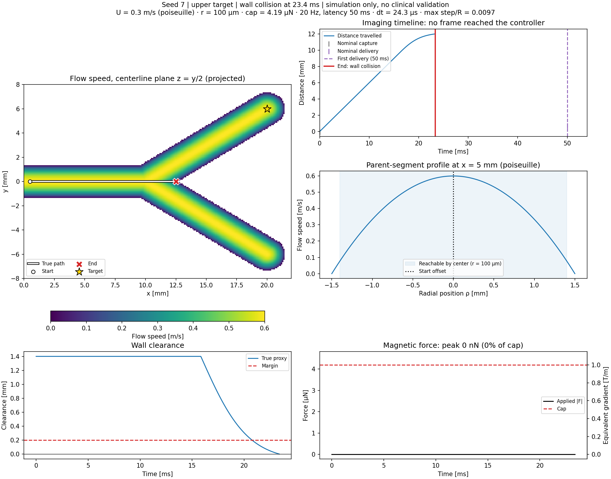
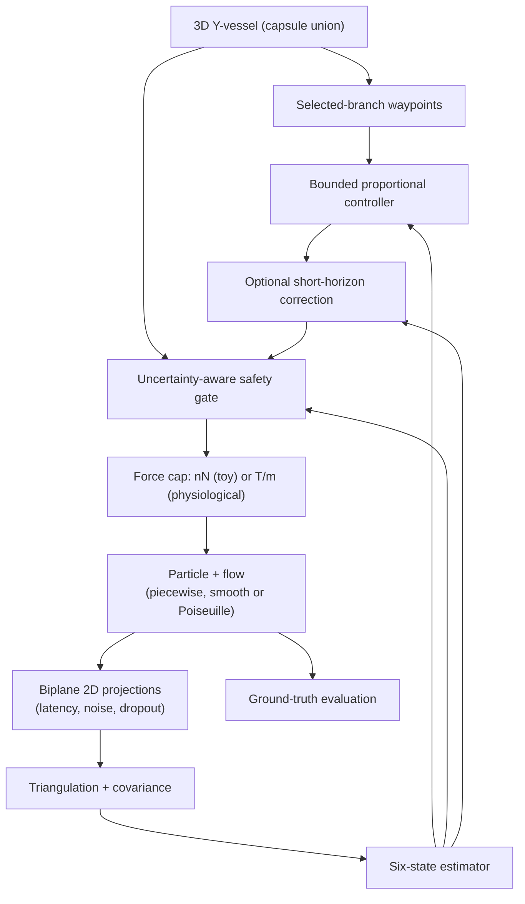
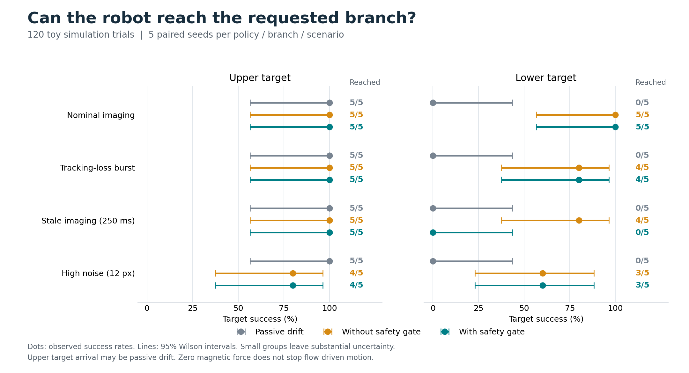
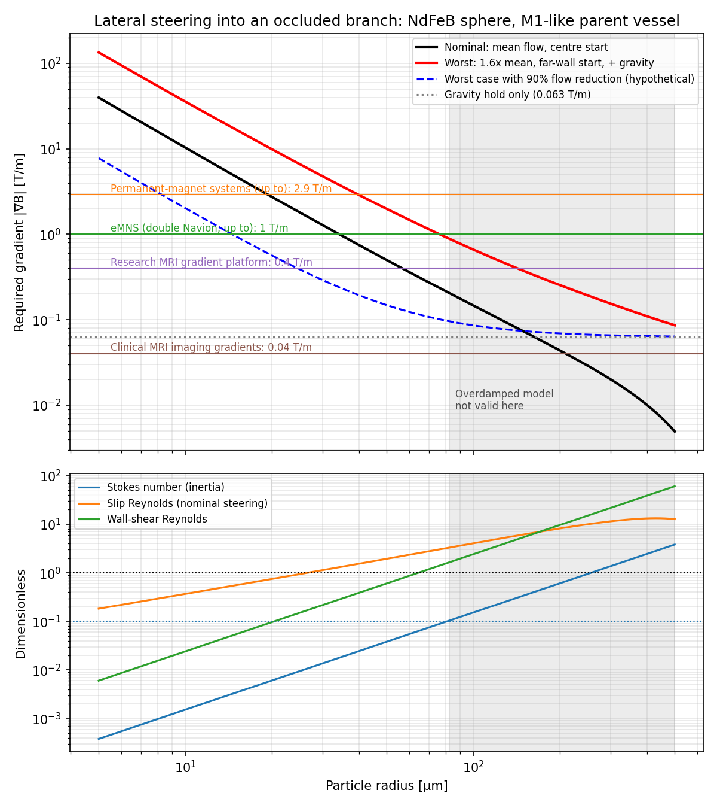

# Safe Magnetic Microrobot Navigation

**Closed-loop magnetic steering of a microrobot through a 3D vessel bifurcation,
under delayed, noisy and intermittent imaging.**

A simulation-first research platform. A magnetized sphere must reach a selected
branch of a Y-shaped vessel while keeping clear of the wall, using only biplane
2D observations that arrive late, carry noise and sometimes drop out.

> **Computational research and education only.** There is no clinical device
> design, no animal or human protocol, and no claim of clinical validity or
> efficacy. Every parameter is either sourced or explicitly marked *assumed*.

## Where the project stands

The first phase (experiments **01–20**) built the full navigation stack on a
deliberately slow **toy plant**: 0.6 mm/s flow and a 3 nN force cap. The
analytical feasibility study ([docs/14](docs/14_feasibility.md)) then asked
what changes at **real cerebral scale** (M1 artery, ~0.3 m/s mean flow):

- With a ~1 T/m clinical electromagnetic system, worst-case steering needs a
  particle radius of about 80 µm or more. That is exactly where the overdamped
  Stokes model used so far stops being valid (Stokes number > 0.1).
- Pure NdFeB needs 0.063 T/m just to hold against gravity. Clinical MRI
  imaging gradients (0.02–0.04 T/m) cannot do that.
- Reducing proximal flow widens the feasible window far more than a stronger
  gradient does.

**Step 2, now in progress**, moves the simulator itself to physiological
scale. Real-scale physics is added as opt-in options. The toy defaults stay
unchanged so experiments 01–20 remain exactly reproducible.

| Stage | Content | Status |
|---|---|---|
| 2a | Force cap in T/m from gradient × magnetization × volume; configurable radius and material | ✅ |
| 2b | Poiseuille velocity profile; timestep shrinks automatically with speed | ✅ |
| 2c | Particle inertia (reduced Maxey–Riley, added mass, finite-Re drag) | ✅ |
| 2d | Pulsatile flow, Womersley number reported | planned |
| 2e | Gravity and a sedimentation check in the safety gate | planned |
| 2f | `physiological` preset, flow-reduction factor, occluded branch, imaging-rate sweep, experiment 22 | planned |

First real-scale result (2b): at 0.3 m/s the particle reaches the bifurcation
wall **23 ms** after release. With 50 ms imaging latency, the first frame
never arrives. The simulator is meant to show that kind of closed-loop failure
honestly, not tune it away.

```bash
python -m simulations.21_physiological_trial                             # 0.3 m/s: collision at 23 ms
python -m simulations.21_physiological_trial --speed 0.003 --duration 3  # 99% flow reduction
python -m simulations.21_physiological_trial --start-mm 0.5 0.6 0.3 --inertia  # off-axis, inertial
```



The figure shows the flow map with the path, the imaging timeline against
distance travelled, the velocity profile, wall clearance, and force in physical
units with the equivalent gradient. With 99% flow reduction every frame arrives
in time, but the peak force is only ~0.06% of the 4.2 µN cap: the control gain
is still the toy value and has not been rescaled yet.

Inertia matters at this scale (2c). For a 100 µm particle released 0.67 mm off
axis at 0.3 m/s, St = 0.15 and the slip Reynolds number peaks near 10. At the
bend, the inertial particle cuts across the streamlines, running 0.2–0.5 mm
closer to the branch centerline than the overdamped one. In this run the
inertial particle passes within the 0.4 mm target tolerance and the overdamped
one hits the closed outlet cap. **Neither run applies any force**, since no
frame arrives before 50 ms, so this is passive transport, not steering.

## Quick start

Python 3.10+ is required (tested with 3.12).

```bash
git clone https://github.com/kuchris/safe-magnetic-microrobot-navigation.git
cd safe-magnetic-microrobot-navigation
python -m venv .venv
source .venv/bin/activate          # Windows: .venv\Scripts\activate
python -m pip install -r requirements.txt
python -m pytest -q
```

Run experiments **as modules from the repository root**, so that `src`
imports resolve. `python simulations/...` is not supported.

```bash
python -m simulations.04_biplane_localization --branch lower --seed 7
python -m simulations.06_benchmark --seeds 0 1 2 3 4 --output outputs/06_benchmark_pilot
python -m simulations.20_feasibility
```

Demos 02 and 03 open a plot window; prefix `MPLBACKEND=Agg` to run them
headless. Everything else saves to `outputs/`, which Git ignores.

### A trial in code

```python
from src.experiment import TrialConfig, run_trial

# Toy plant (legacy defaults, as in experiments 01-20)
toy = run_trial(TrialConfig(seed=7, branch="upper"))

# Real-scale options (Step 2, opt-in)
real = run_trial(TrialConfig(
    flow_model="poiseuille", flow_speed_m_s=0.3,     # M1 cross-sectional mean
    particle_radius_m=100e-6, max_gradient_t_m=1.0,  # NdFeB sphere, ~1 T/m eMNS
    duration_s=0.2))
print(real["summary"]["physics"])  # force cap, dt, step/radius fraction, ...
```

## Architecture



The control boundary is `BiplaneNavigation.step(now_s, frames)`. It receives
only time and delivered frames. True position, velocity and flow never cross
it; they stay in the simulated plant and in evaluation.

## Physics model

For a magnetic dipole, `τ = m × B` and `F = ∇(m·B)`. The implemented dynamics
use an ideal force vector with a magnitude cap. There is no coil or torque
model yet.

**Particle, overdamped (default).** Stokes sphere:

$$
\gamma = 6\pi\eta r,\qquad v = u + F/\gamma,\qquad p_{k+1} = p_k + \Delta t\,v_k .
$$

This is valid only for small Stokes and particle Reynolds numbers. At real
scale that holds only below r ≈ 80 µm.

**Particle, inertial (`particle_inertia=True`).** Reduced Maxey–Riley with
added mass and Schiller–Naumann drag:

$$
(m_p + \tfrac{1}{2}m_f)\,\dot v = F + \gamma\,f(Re)\,(u - v),\qquad f = 1 + 0.15\,Re^{0.687}.
$$

Each step holds u, F and f fixed and integrates exactly, so it is stable for
any dt and reduces to the overdamped model as the relaxation time goes to
zero. The particle is released at the local flow velocity (assumed). The model
omits the fluid-acceleration term (zero in straight Poiseuille flow, nonzero at
the junction), the Basset history force and shear lift. Densities: NdFeB
7500 kg/m³ and blood 1060 kg/m³, both assumed. The summary reports τ, the
Stokes number τU/L and the peak slip Reynolds number.

**Force cap.** Two modes are available:
- `max_force_n` (toy default, 3 nN).
- `max_gradient_t_m > 0`, which gives a cap of `V · M_eff · |∇B|`. This is a
  best-case upper bound: it assumes a saturated moment aligned with the
  gradient and ignores gradient decay with depth.

**Flow models** (`flow_model`):

| Model | Description | Default for |
|---|---|---|
| `piecewise` | Uniform speed along inlet or branch direction; discontinuous at the junction | 01–20 |
| `smooth` | Continuous tanh blend of directions; uniform speed | 11–19 option |
| `poiseuille` | Smooth direction × `2U(1 − ρ²/R²)`; U is the cross-sectional mean | Step 2 |

None of these is a hemodynamics solver: there is no flux conservation at the
split, no secondary flow and no Faxén correction. In `poiseuille` mode the
timestep shrinks so that one step moves at most `max_step_radius_fraction`
(0.02, assumed) of the vessel radius. The realized value is reported.

**Geometry.** The vessel is a union of three capsules. The clearance proxy is
`max_e(R_e − r − distance_e)`: exact for one capsule, conservative where
capsules overlap, and **not** the exact union signed distance. A "collision"
is a sampled violation of this proxy. See [docs/02](docs/02_low_reynolds_flow.md).

## Imaging, estimation and safety

- **Imaging:** two configurable orthographic views give noisy 2D detector
  coordinates. There is no image rendering or segmentation. Frame rate,
  latency, random dropout, dropout bursts and a fixed per-trial calibration
  offset are configurable.
- **Reconstruction:** SVD triangulation for arbitrary view geometry,
  propagating detector noise into a full 3D covariance. The calibration
  uncertainty is kept as a floor that repeated frames cannot remove.
- **Estimation:** a Kalman filter on `[p, v]`, updated at capture time and
  predicted forward to control time.
- **Safety gate:** force is allowed only if
  `clearance − k_σ·σ > margin` and tracking is fresh. Otherwise commanded
  force is zero. **Zero force does not stop the particle**: flow, and from
  stage 2e gravity, still move it.

Logged reasons: `tracking_lost`, `localization_uncertain`, `wall_margin_low`,
`actuation_limit`, `prediction_adjustment`, `safe`. See
[docs/03](docs/03_biplane_localization.md), [docs/04](docs/04_state_estimation.md)
and [docs/05](docs/05_safety_control.md).

## Experiments

Experiments 01–19 run the toy plant; 20 is analytical; 21 is the first real-scale script. Archived results live in
`docs/results/`. Tests replay archived benchmark and flow-estimation trials, so a
change that alters the legacy defaults fails the suite.

| # | Script | What it does | Report |
|---|---|---|---|
| 01 | `01_free_space` | Flow plus magnetic drift in free space | [01](docs/01_magnetic_actuation.md) |
| 02 | `02_y_vessel` | Y-vessel navigation with an ideal sensor | [02](docs/02_low_reynolds_flow.md) |
| 03 | `03_noisy_closed_loop` | Noisy localization with fail-safe stopping | [06](docs/06_validation.md) |
| 04 | `04_biplane_localization` | One biplane trial: summary, history, diagnostics | [03](docs/03_biplane_localization.md) |
| 05 | `05_latency_safety` | Latency, dropout and noise stress scenarios | [06](docs/06_validation.md) |
| 06–07 | `06_benchmark`, `07_plot_benchmark` | Paired-seed passive / ungated / gated comparison with Wilson intervals | [07](docs/07_benchmark.md) |
| 08 | `08_failure_replay` | Replays nine failures, with event evidence and GIF | [08](docs/08_failure_analysis.md) |
| 09–10 | `09_approach_guidance`, `10_guidance_figures` | Pre-junction lateral offset; pilot and held-out seeds | [09](docs/09_approach_guidance.md) |
| 11–12 | `11_flow_sensitivity`, `12_…_figures` | 360 trials across flow speed, disturbance and flow model | [10](docs/10_flow_sensitivity.md) |
| 13–14 | `13_predictive_control`, `14_…_figures` | Optional 0.5 s short-horizon correction | [11](docs/11_predictive_control.md) |
| 15–17 | `15_estimation_audit` … `17_…_figures` | Command-aware estimator and forecast audit | [12](docs/12_flow_estimation.md) |
| 18–19 | `18_terminal_guidance`, `19_…_figures` | Optional terminal target intercept | [13](docs/13_terminal_guidance.md) |
| 20 | `20_feasibility` | Analytical real-scale gradient and size requirements | [14](docs/14_feasibility.md) |
| 21 | `21_physiological_trial` | One real-scale trial (Step 2 options) with physics diagnostics | this README |

Scripts 11, 13, 15, 16 and 18 take `--model piecewise|smooth`. Scripts 15–17 need the
trace files written by 13.

### Key findings

- **The safety gate trades progress for clearance.** Under stale imaging the
  gate inhibits force for the whole trial. An upper-branch "success" is then
  pure passive advection: toy flow picks the upper branch at y = 0. The same
  setting aimed at the lower branch ends in a wrong-branch wall violation.
- **Zero force is not a hold state.** Cancelling 0.6 mm/s of toy flow takes
  about 3.96 nN, above the 3 nN cap. At real scale, flow and gravity make this
  much worse (docs/14).
- **Terminal guidance helped; other add-ons did not clearly help.**
  - Terminal target guidance rescued 21 matched failures with no regressions
    (320 runs). All 17 remaining failures involved a wrong-branch event.
  - Short-horizon correction rescued 1 failure in 160 trials.
  - The command-aware estimator cut forecast error by ~6% but regressed 3
    closed-loop trials against 1 rescue.
  - All three stay off by default.





## Parameters

**Toy defaults (experiments 01–20).** These are chosen for a controllable test
bed. They are *not* physiological and *not* validated.

| Parameter | Value |
|---|---|
| Vessel / particle radius | 1.5 mm / 0.1 mm |
| Viscosity / flow speed | 3.5 mPa·s / 0.6 mm/s |
| Timestep / time limit | 5 ms / 40 s |
| Frame rate / latency | 20 Hz / 50 ms |
| Pixel size / detector noise / calibration σ | 50 µm/px / 1 px / 0.25 px |
| Force cap / proportional gain | 3 nN / 2×10⁻⁶ N/m |
| Safety margin / σ limit / k_σ / max capture age | 0.20 mm / 0.35 mm / 3 / 150 ms |
| Target tolerance / wrong-branch exclusion | 0.4 mm / 2 mm |

**Physiological options (Step 2).** Sources are listed in
[docs/14](docs/14_feasibility.md#parameters-and-provenance).

| Parameter | Value | Status |
|---|---|---|
| M1 lumen radius | 1.5 mm | MRI measurements |
| Cross-sectional mean flow | 0.30 m/s | TCD mean velocity, halved for Poiseuille; cross-checked with volumetric flow |
| Gradient references | 0.04 / 0.4 / 1 / 2.9 T/m | Clinical MRI / research MRI / eMNS / permanent magnets (best case) |
| NdFeB magnetization / density | 1.0×10⁶ A/m / 7500 kg/m³ | Textbook, **assumed** |
| Blood viscosity / density | 3.5 mPa·s / 1060 kg/m³ | **Assumed** |
| Max step / vessel radius | 0.02 | Numerical accuracy target, **assumed** |

The control gain is still the toy value and has not yet been rescaled for
T/m-scale forces.

## Repository layout

```text
src/
  experiment.py         TrialConfig, seeded trial loop, histories, summary metrics
  particle.py           Overdamped Stokes particle
  flow.py               Piecewise / smooth / Poiseuille flow, OU disturbances
  vessel.py             Capsule Y geometry and clearance proxy
  feasibility.py        Analytical real-scale estimates, gradient → force cap
  imaging.py            Orthographic views, latency, dropout
  localization.py       Triangulation and six-state filter (plus legacy sensor)
  flow_estimation.py    Command-aware estimator
  navigation.py         Observation-only control boundary
  planner.py            Branch waypoints and wrong-branch test
  controller.py         Proportional control and force limit
  prediction.py         Optional short-horizon and terminal correction
  safety.py             Uncertainty, freshness and wall-margin gate
  benchmark.py          Policy comparison, Wilson intervals, reports
  flow_sensitivity.py   Sensitivity summaries and flow-holding diagnostics
  failure_analysis.py   Replay events and terminal wall features
  prediction_audit.py   Offline forecast-error audit
  plotting.py           Toy diagnostics and physiological-scale diagnostics
  replay_plotting.py    Paired replay figures and animation
  validation.py         Input validation
simulations/            Experiments 01–21 (run with python -m)
tests/                  Unit, integration and archived-result regression tests
docs/                   Method notes, results (docs/results) and figures
```

## Roadmap

- [x] Biplane imaging, covariance-aware triangulation, six-state estimation
- [x] Observation-only navigation with an uncertainty-aware stop gate
- [x] Paired-seed benchmark, failure replay, flow-sensitivity study
- [x] Optional approach guidance, short-horizon correction, command-aware
      estimation, terminal guidance
- [x] Analytical physiological-scale feasibility map
- [x] Gradient cap in T/m with material parameters (2a)
- [x] Poiseuille profile with speed-bounded timestep (2b)
- [x] Particle inertia and finite-Re drag (2c)
- [ ] Pulsatility (2d)
- [ ] Gravity and sedimentation-aware safety gate (2e)
- [ ] Physiological preset, flow reduction, occluded branch, actuation update
      rate, imaging-rate sweep (2f)
- [ ] Coil model A(x) with current allocation; gradient decay with depth
- [ ] Mesh geometry, exact wall distance, swept collision checks
- [ ] Perspective imaging, segmentation, outliers
- [ ] Formal predictive safety (MPC / control barrier functions)

The supervisor is a reactive gate, not a formal safety guarantee. Benchmark
rates describe only the configured scenarios. There is no cerebral
hemodynamics model, and no result here says anything about clinical use.
