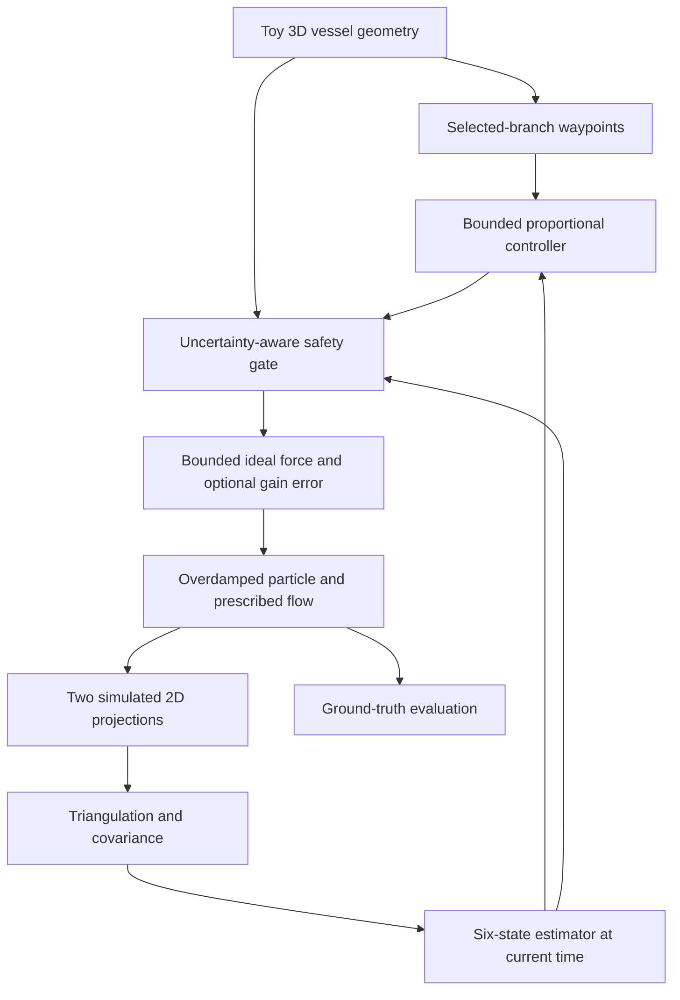

# Safe Magnetic Microrobot Navigation

**Safe Real-Time Closed-Loop Magnetic Navigation of Microrobots in 3D Vascular Networks**

A simulation-first platform for studying navigation with uncertain, delayed
localization. The current working milestone is a **toy Y-vessel with biplane
2D observations, 3D reconstruction, six-state estimation and uncertainty-aware
actuation stopping**.

> Computational research/education only. No human/animal experimental protocol,
> clinical device design, or clinical validity is provided. All runnable
> numerical defaults are **toy parameters**, not medically realistic values.

## Motivation and research question

Can feedback steer a magnetically actuated particle toward a selected vascular
branch while reducing vessel-wall risk under flow, localization error,
calibration error, imaging delay and lost tracking?

Reaching a target alone is insufficient evidence. This project prioritizes
wall clearance, wall violations, wrong-branch events and uncertainty-triggered
stopping over speed. The present experiments test software/model behavior;
they do not establish safety in real vasculature.

## Implemented architecture



The software control boundary is `BiplaneNavigation.step(now_s, frames)`.
It accepts only delivered observations and time. True position stays in the
simulated plant/imaging boundary and evaluation. No filter uses truth for
initialization. The older Y demo uses an explicitly ideal observation sensor.

## Physics and assumptions

For a fixed magnetic dipole:

$$
\tau=m\times B,\qquad F_m=\nabla(m\cdot B).
$$

For the initial overdamped spherical-particle approximation:

$$
\gamma=6\pi\eta r,\qquad F_{drag}=\gamma(u-v),\qquad
v\approx u+F_m/\gamma,\qquad p_{k+1}=p_k+\Delta t\,v_k.
$$

SI units: position/radius [m], time [s], velocity [m/s], force [N],
viscosity [Pa s], magnetic moment [A m²], magnetic field [T].

Implemented dynamics use an ideal force-vector abstraction. Torque, dipole
orientation, field gradients and coils are conceptual equations only.
Stokes/overdamped behavior assumes small particle Reynolds number and short
inertial relaxation time; those assumptions are not experimentally validated
for the toy defaults. The prescribed branch-aligned flow is not a hemodynamics
solver and has no radial profile or conserved bifurcation flux.

The geometry is a **union of capsules** with rounded ends. Clearance is
`max_e(radius_e - particle_radius - distance_to_segment_e)`. It is exact for
one capsule and a conservative interior bound at overlaps, **not the exact
union signed-distance field**. Reported collisions mean sampled violations
of this proxy. See [physics and geometry assumptions](docs/02_low_reynolds_flow.md).

## Installation and execution

Python **3.10+** is required. Tested here with Python 3.12, NumPy 2.3.5,
Matplotlib 3.10.8 and pytest 9.1.1.

```bash
git clone https://github.com/kuchris/safe-magnetic-microrobot-navigation.git
cd safe-magnetic-microrobot-navigation
python -m venv .venv
source .venv/bin/activate
python -m pip install -r requirements.txt
python -m pytest -q
```

On Windows, activate with `.venv\Scripts\activate`. Run simulations **as
modules from the repository root**, so `src` imports resolve:

```bash
python -m simulations.01_free_space
python -m simulations.02_y_vessel
python -m simulations.03_noisy_closed_loop
python -m simulations.04_biplane_localization
python -m simulations.05_latency_safety
```

The older 02/03 demos display a plot. For headless runs, prefix with
`MPLBACKEND=Agg` on Unix. The newer 04/05 experiments always save plots without
a display. Direct `python simulations/...` execution is not supported.

```bash
python -m simulations.04_biplane_localization --branch lower --seed 7
python -m simulations.04_biplane_localization --latency 0.10 --noise 2 --dropout 0.05
python -m simulations.04_biplane_localization --output outputs/my_trial
python -m simulations.05_latency_safety --output outputs/stress
```

04 saves `summary.json` (configuration and metrics), `history.npz` and
`diagnostics.png`. 05 saves the same per scenario plus `comparison.json`.
The plots include both trajectories, centerlines, target, stop locations,
localization error, uncertainty, clearance and force components/magnitude.
Generated outputs are ignored by Git and can be reproduced with the commands above.

## Current numerical example

Measured seed-7 results for the implemented toy model:

| Scenario | Success | Wall violation | Wrong branch | Min. clearance proxy [mm] | RMSE [mm] | Stop samples [%] | Time to target [s] |
|---|---:|---:|---:|---:|---:|---:|---:|
| Nominal, 50 ms latency | Yes | No | No | 1.3732 | 0.06010 | 0.181 | 27.660 |
| Tracking-loss burst, 8.00–8.75 s | Yes | No | No | 1.3691 | 0.07708 | 2.874 | 27.835 |
| Stale imaging, 250 ms latency | Yes | No | No | 1.3994 | 0.08475 | 100.000 | 35.240 |
| Stale imaging, lower target | No | Yes | Yes | -0.00224 | 0.08431 | 100.000 | — |
| High detector noise, 12 px sigma | Yes | No | No | 1.2406 | 0.32706 | 3.940 | 28.295 |

**The stale-imaging result is passive advection:** active force is zero
throughout. The toy flow chooses the upper branch when y = 0, so this scenario
can reach the upper target without navigation. It is not evidence of controller
effectiveness. 05 also runs `stale_lower_target` to expose this branch-selection
failure when the intended target is the other branch.
That run enters the upper branch and eventually violates the artificial
rounded outlet boundary at 38.24 s, with zero active force throughout.

The free-space example ends at [2, 1, 0] mm. The baseline suite had eight tests;
the expanded suite passes 57 tests covering imaging, uncertainty, timing,
safety and both branches.
See [inspection and verification record](docs/06_validation.md) for measured
results and known limitations. These deterministic runs are not a Monte Carlo
success/collision-rate estimate.


## Imaging, estimation and safety

- Two configurable orthographic views produce noisy 2D detector coordinates.
  This does not render medical images or model segmentation.
- SVD-based reconstruction supports arbitrary view orientations, origins,
  pixel sizes and offsets. Singular geometry is rejected. Random detector
  covariance is propagated into full 3D covariance.
- A fixed detector-offset calibration error is sampled once per trial.
  Its uncertainty is retained as a floor that repeated frames cannot remove.
- Configurable frame rate, fixed latency, stochastic pair dropout and dropout
  bursts are supported. Frames carry capture and delivery timestamps.
- The Kalman state is `[px,py,pz,vx,vy,vz]`. Prediction and update are separate.
  Updates occur at capture time, with a predicted copy exposed at control time.
- Safety requires
  `estimated_clearance - k_sigma * position_uncertainty > safety_margin`.
  Large uncertainty, lost tracking, stale images or low robust clearance
  produce zero active force. This does **not** stop flow-driven motion.
- Logged reasons are `tracking_lost`, `localization_uncertain`,
  `wall_margin_low`, `actuation_limit` and `safe`. Saturation is distinct
  from stopping. A three-sigma margin is not a proven 3D collision-risk bound.

See [biplane imaging](docs/03_biplane_localization.md),
[state estimation](docs/04_state_estimation.md) and
[safety/control](docs/05_safety_control.md).

## Parameter provenance

**Every numerical default below is toy, none is experimentally validated.**
Equations are textbook idealizations; no empirical physiological calibration
or literature-derived parameter set is claimed.

| Parameter | Biplane default |
|---|---|
| Vessel radius / particle radius | 1.5 mm / 0.1 mm |
| Viscosity / prescribed flow speed | 3.5e-3 Pa s / 0.6 mm/s |
| Physics timestep / time limit | 5 ms / 40 s |
| Frame rate / fixed latency | 20 Hz / 50 ms |
| Detector pixel size / independent noise sigma | 50 µm/px / 1 px |
| Fixed calibration-offset prior sigma | 0.25 px per detector coordinate |
| Pair dropout / flow disturbance / actuation gain error | 0 / 0 / 0 |
| Force limit / proportional gain | 3 nN / 2e-6 N/m |
| Safety margin / largest-axis sigma limit | 0.20 mm / 0.35 mm |
| Sigma multiplier / maximum capture age | 3 / 150 ms |
| Initial velocity mean / sigma | 0 / 1 mm/s per axis |
| Acceleration spectral density | 1e-7 m²/s³ |
| Waypoint spacing / advance tolerance | 0.5 mm / 0.3 mm |
| Target tolerance / wrong-branch exclusion radius | 0.4 mm / 2 mm |

Programmatic experiment configuration lives in `TrialConfig`; view geometry
and filter options can also be configured through their component APIs.
Legacy demos retain their original toy parameter choices.

## Repository structure

```text
src/
  particle.py           Overdamped Stokes dynamics
  vessel.py             Capsule Y geometry and clearance proxy
  flow.py               Prescribed piecewise flow
  imaging.py            Orthographic projections and delayed/dropout frames
  localization.py       Legacy sensor/filter, triangulation, six-state filter
  planner.py            Selected Y-branch waypoints and branch evaluation
  controller.py         Proportional control and force cap
  safety.py             Uncertainty, freshness and wall-margin gate
  navigation.py         Observation-only feedback boundary
  experiment.py         Seeded trial, histories and metrics
  plotting.py           Reproducible diagnostic figure
  validation.py         Numerical input validation
simulations/
  01_free_space.py
  02_y_vessel.py
  03_noisy_closed_loop.py
  04_biplane_localization.py
  05_latency_safety.py
docs/                    Physics, imaging, estimation, safety, verification
tests/                   Deterministic physics, numerical and integration tests
```

## Progress and roadmap

- [x] Overdamped particle integration, prescribed flow and capsule Y-vessel
- [x] Bounded proportional control and direct noisy-observation baseline
- [x] Biplane coordinate projection and covariance-aware reconstruction
- [x] Configurable frame rate, fixed latency, dropout and fixed-offset calibration error
- [x] Six-state filter with separate prediction/update and capture-time handling
- [x] Observation-only navigation and robust-clearance stop gate
- [x] Explicit upper/lower Y branch and centerline waypoint following
- [x] Logged stop reasons, wrong-branch flag, seeded trials and diagnostic plots
- [x] Deterministic latency/dropout/noise stress scenarios and regression tests
- [ ] General vascular graph routing and branch-crossing surfaces
- [ ] Exact union/mesh wall distance and swept collision checking
- [ ] Perspective/raster imaging, segmentation, outliers and single-view handling
- [ ] Rotation/scale calibration estimation and variable-latency replay
- [ ] Abstract coil matrix A(x), bounded current allocation, unreachable-force diagnostics
- [ ] Monte Carlo distributions, aggregate safety rates and confidence intervals
- [ ] Control-input-aware estimation and flow disturbance estimation
- [ ] Predictive safety constraints, then MPC / Control Barrier Functions
- [ ] Synthetic/public mesh import and improved fluid/near-wall physics

No RL, coil-current solver, general vascular graph, mesh loader or Monte Carlo
study is claimed complete. The current supervisor is a reactive gate, not a
formal safety guarantee. There is no full cerebral hemodynamics model.
