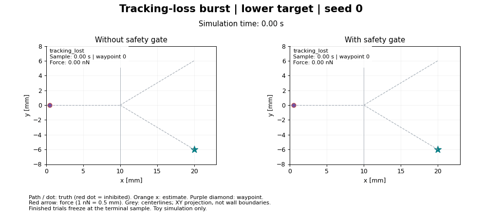
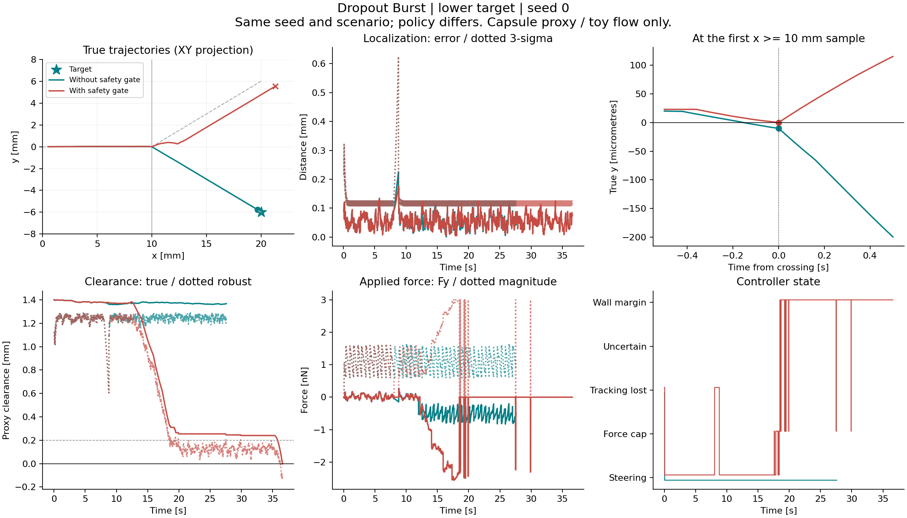

# Failure replay: branch selection and terminal geometry

Nine selected pilot trials were replayed without changing controller, planner,
physics or stopping behavior. Every original summary matched exactly. The only
experiment change records the selected waypoint and index after each control
step; reading these values does not advance the planner. Four additional runs
checked finer physics/control timesteps.

## Main finding

The prescribed flow has a discontinuous branch rule: before x = 10 mm it points
along the inlet; afterwards y >= 0 selects the upper direction and y < 0 the
lower direction. Several failed lower-target trials first pass x = 10 mm with
a tiny positive y. Even though the selected waypoint is in the lower branch,
the commanded lateral force at that sample is insufficient to counter the
new upper-directed flow. This is a mechanism in the toy model, not evidence
about physical vascular bifurcations.

The safety gate subsequently changes the trajectory and termination mechanism.
Removing it is not a generally successful remedy: seed 2 reverses the seed-0
success/failure comparison, and both policies fail the selected high-noise case.

## Success / failure animation



Both panels request the lower target with seed 0 and the same 8.00-8.75 s
tracking-loss burst. The animation shows true and estimated position, the
selected waypoint, applied force and controller state. The current waypoint
is displayed even while actuation is inhibited; it is not an active command
in that state. The figures project 3D trajectories onto XY. Grey centerlines
are not wall boundaries. Completed trials freeze at their terminal samples.

## Event evidence

Times and positions below refer to the **first sampled x >= 10 mm state**,
not an interpolated exact crossing. Baseline samples are 5 ms apart.
The wrong-branch detector waits until the particle is more than 2 mm from the
junction, so its confirmation occurs later than the flow-direction choice.

| Scenario | Seed | Policy | Junction time s | True y at junction um | Success | Wrong branch confirmed s | Terminal feature |
|---|---:|---|---:|---:|---|---:|---|
| Nominal | 0 | Gated | 12.375 | -0.610 | Yes | N/A | Target reached |
| Dropout burst | 0 | Ungated | 12.390 | -10.166 | Yes | N/A | Target reached |
| Dropout burst | 0 | Gated | 12.560 | +0.156 | No | 17.325 | Closed outlet cap proxy |
| Dropout burst | 2 | Ungated | 12.435 | +0.285 | No | 17.260 | Capsule sidewall proxy |
| Dropout burst | 2 | Gated | 12.565 | -11.409 | Yes | N/A | Target reached |
| Stale imaging | 1 | Ungated | 12.435 | -56.281 | Yes | N/A | Target reached |
| Stale imaging | 1 | Gated | 15.835 | 0.000 | No | 19.170 | Closed outlet cap proxy |
| High noise | 0 | Ungated | 13.185 | +38.803 | No | 17.750 | Capsule sidewall proxy |
| High noise | 0 | Gated | 13.200 | +39.229 | No | 17.290 | Closed outlet cap proxy |

Complete event states, waypoint selections, forces and prescribed/net
velocities are in [failure_replay.json](results/failure_replay.json).

## Dropout seed 0: what happened



1. The gated trial first selects branch waypoint 20 at 12.200 s:
   [10.4, -0.24, -0.12] mm. Thus the selected route is already the intended
   lower branch before the first junction-crossing sample at 12.560 s.
2. At that sample true y is +0.156 um while estimated y is -101.507 um.
   The flow model uses truth, not the estimate, and selects the upper branch.
   Its y velocity is +0.299 mm/s. Applied Fy is -0.277 nN; after Stokes drag
   conversion the net y velocity is still +0.257 mm/s.
3. The wrong branch is confirmed at 17.325 s. The first wall-margin stop after
   the junction occurs at 18.500 s. There are brief later reactivations;
   continuous inhibition starts at 29.925 s. Zero force permits passive drift.
4. The trial ends at 36.595 s beyond the upper outlet, at a closed-outlet cap
   proxy violation. It does not reach the requested lower target.

Without the gate, the paired trial first crosses with negative y and arrives
at the lower target at 27.595 s. The interventions change motion and later
observation positions, so this pair alone cannot isolate every contribution
of estimation, waypoint timing and actuation inhibition.

## Reverse comparison and other failures

For dropout seed 2, gated control succeeds and ungated control fails. At the
first junction sample, gated true y is -11.409 um but ungated true y is
+0.285 um. The ungated run later pulls toward the lower route while outside
the intended branch and terminates at a capsule sidewall proxy at 19.880 s.
See [the seed-2 diagnostic figure](figures/replay_dropout_burst_seed_2.png).

High-noise seed 0 crosses with positive y under both policies and both fail.
Ungated control terminates at a sidewall proxy at 20.165 s; gated control
first triggers a post-junction wall stop at 16.670 s and eventually reaches
an artificial outlet cap at 36.790 s. See
[the high-noise diagnostic figure](figures/replay_high_noise_seed_0.png).

With 250 ms imaging latency, gated seed 1 applies no force throughout.
The planner stays at its initial waypoint because the gate never allows a
planner update. True y = 0 selects upper flow by definition. Ungated seed 1
reaches the lower target; this does not establish safe operation with stale
data. See [the latency diagnostic figure](figures/replay_stale_imaging_seed_1.png).

## Timestep / control-rate sensitivity

Both selected failures persist with finer timesteps. This weakens an
explanation based solely on a coarse 5 ms update, but does not establish
numerical convergence or robust behavior across seeds.

| Dropout case | Timestep ms | True y at first junction sample um | Outcome |
|---|---:|---:|---|
| Seed 0, gated | 5.0 | +0.156 | Failure, outlet cap proxy |
| Seed 0, gated | 2.5 | +0.058 | Failure, outlet cap proxy |
| Seed 0, gated | 1.0 | +0.084 | Failure, outlet cap proxy |
| Seed 2, ungated | 5.0 | +0.285 | Failure, sidewall proxy |
| Seed 2, ungated | 2.5 | +0.141 | Failure, sidewall proxy |
| Seed 2, ungated | 1.0 | +0.117 | Failure, sidewall proxy |

The controller runs every physics tick, so these checks change both integration
and control resolution. Imaging remains at 20 Hz. This is not an isolated
integrator convergence study. Full results are in
[resolution_sensitivity.json](results/resolution_sensitivity.json).

## Interpreting wall events

The new diagnostic labels the capsule giving the largest clearance at the
terminal point. It calls an event a closed-outlet cap only if the point lies
beyond that outlet and would fit inside its straight extended tube. A closest
point on a capsule segment interior is labeled a capsule sidewall proxy.
Remaining cap/overlap cases stay explicitly ambiguous.

These are retrospective labels for the existing sampled clearance proxy.
They do not replace exact union geometry or swept contact checking, and do not
change benchmark outcome counts. A wrong-branch event and an outlet-cap event
can both occur in one trial; they are not mutually exclusive outcomes.

## Recommended next change

First make the route controller account for the branch decision **before** the
flow switch: evaluate a lateral approach margin and required steering force
under estimated flow, localization uncertainty and the force cap. These replays
show the correct branch waypoint was selected, but selection alone provided
too little lateral margin in the failed cases. This is a hypothesis to test,
not a proven controller fix.

Use both dropout seeds, high-noise cases and both target branches as regression
cases. Compare against the unchanged pilot policies, extend the seed set and
report outlet events separately. In parallel with later model work, replace
the hard sign-based flow switch with an explicitly documented junction model
and check whether conclusions survive that modeling change.

## Reproduction and validation

```bash
python -m pytest -q
python -m simulations.08_failure_replay
```

The runner saves nine histories and original summaries, an event table/JSON,
resolution checks, four PNG diagnostics and a 140-frame GIF under
`outputs/08_failure_analysis`. The GIF is about 11.7 seconds long and uses
sampled states at accelerated playback speed. Three frames, including the
terminal view, were visually checked; the footer layout was corrected.
The final suite passes 72 tests. Dedicated checks cover feature classification,
the flow discontinuity, missing events, waypoint logging and observation-free
event snapshots. No control decisions were changed in this milestone.
