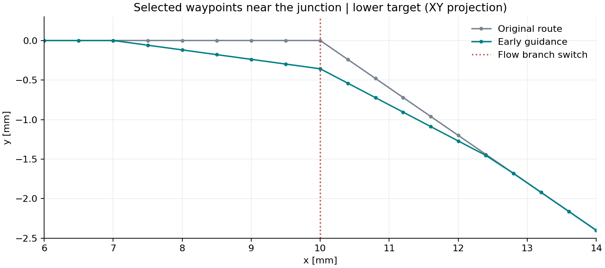
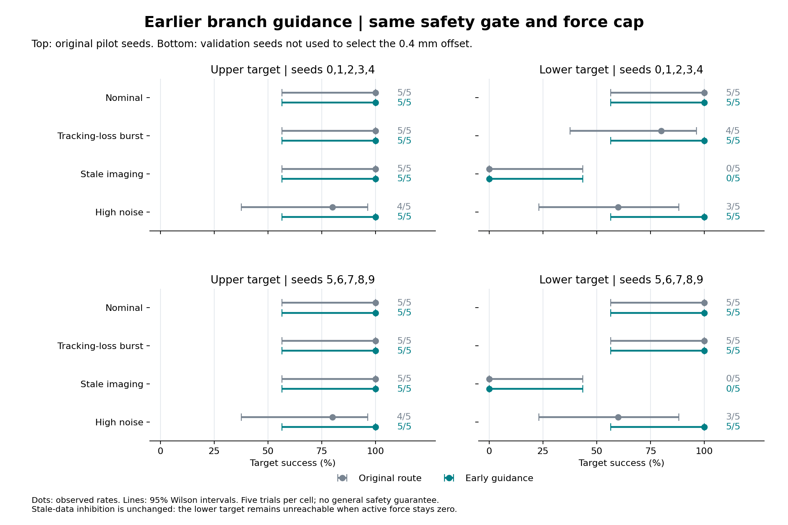
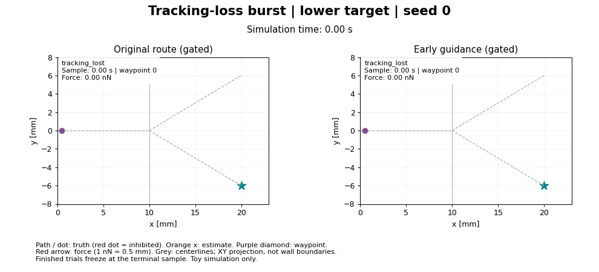

# Earlier branch guidance: implementation and paired evaluation

The optional approach route reduces branch-selection failures in the tested toy
model. Across 240 matched cases (480 executions), 16 original failures became
successes and no original successes became failures. These counts combine
policies and scenarios for bookkeeping; they are not a pooled safety-rate
estimate. The prescribed flow, estimator, proportional gain, force cap and
safety thresholds were unchanged.

## What changed



The original route stays on the inlet centerline until the junction. The new
route shifts waypoints toward the selected branch before reaching it, then
rejoins the branch centerline. It uses geometry only, with the same estimated
position for waypoint advancement as before.

For an original waypoint p at centerline distance d from the junction:

`p_new = p + approach_offset_m * max(0, 1 - d / (2 * inlet_radius_m)) * lateral_direction`

The lateral direction is the outgoing branch direction projected perpendicular
to the inlet and normalized. The offset is mirrored for the other branch.
Experiment 09 fixes the maximum transverse offset at 0.4 mm; the default vessel
radius of 1.5 mm gives a 3 mm approach and return span. The initial and final
waypoints remain unchanged. At the junction the lower-route offset is
approximately [0, -0.358, -0.179] mm, whose 3D magnitude is 0.4 mm.

The first candidate offset was checked against four known failure cases and
then held fixed for the full evaluation. Seeds 5-9 were not used to choose this
offset. This is a fixed geometric heuristic, not flow estimation, a calculated
reachability margin, predictive safety control or a general vascular planner.

## Evaluation design

- Original pilot: seeds 0-4, four scenarios, two branches and three policies.
- Validation set: seeds 5-9, the same scenarios, branches and policies.
- Both routes were executed for every case: 120 original plus 120 guided
  executions per seed set, totaling 480.
- All 120 original pilot summaries matched the archived pilot exactly.
- Matched configurations differed only in `approach_offset_m` (0 vs 0.0004 m).
- Passive summaries were identical between routes. Every recorded applied
  force remained within the unchanged 3 nN cap.

## Gated-controller results



Each cell below has five trials. Arrows show original -> guided counts.

| Scenario | Pilot upper | Pilot lower | Validation upper | Validation lower |
|---|---|---|---|---|
| Nominal | 5/5 -> 5/5 | 5/5 -> 5/5 | 5/5 -> 5/5 | 5/5 -> 5/5 |
| Tracking-loss burst | 5/5 -> 5/5 | 4/5 -> 5/5 | 5/5 -> 5/5 | 5/5 -> 5/5 |
| Stale imaging, 250 ms | 5/5 -> 5/5 | 0/5 -> 0/5 | 5/5 -> 5/5 | 0/5 -> 0/5 |
| High detector noise | 4/5 -> 5/5 | 3/5 -> 5/5 | 4/5 -> 5/5 | 3/5 -> 5/5 |

Seven gated cases and nine ungated cases changed from failure to success.
There were no success-to-failure changes in either seed set under any policy.
Ungated guided control reached both targets in every tested scenario/seed,
but bypassing the gate is an ablation, not a recommended safety policy.

The stale gated case deliberately remains unchanged: images are always older
than the 150 ms limit, so no force is applied. Upper-target arrival is passive
drift, and lower-target navigation still fails. Waypoint geometry cannot help
when the gate never permits actuation.

Five successes out of five still have a 95% Wilson interval of approximately
56.6%-100%. The figures and full route reports retain these wide intervals.
No paired significance test, low-risk claim or clinical conclusion is made.

## Wall events and clearance tradeoff

Across the two seed sets, the original ungated route produced nine capsule
sidewall proxy violations; the guided ungated route produced none. Gated
routes produced no sidewall proxy violations in either version. Gated
closed-outlet cap events fell from 17 to 10, with all 10 remaining events in
the stale lower-target condition. Passive lower-target outlet events were
unchanged. These retrospective feature labels do not turn the conservative
capsule proxy into exact contact geometry.

The new route intentionally sacrifices some centerline clearance to obtain
branch-selection margin. Across nominal gated cases, the worst observed true
clearance fell from 1.344 mm to 1.156 mm. The minimum in guided gated
nominal/dropout/high-noise cases was 1.057 mm. These are measured clearances in
the selected runs, not guarantees for other seeds or settings. Force limits
and uncertainty-aware stop conditions were not relaxed.

## Before / after replay



Both panels use the lower target, seed 0, the same dropout burst and the same
safety gate. Only the waypoint route differs. The old route first crosses
x = 10 mm at true y = +0.156 um and eventually reaches the wrong outlet.
The guided route first crosses at y = -175.808 um and reaches the intended
target. It creates a larger lateral margin before the toy flow switches
direction. These are sampled crossing positions, not exact crossing surfaces.

[The six-panel diagnostic figure](figures/guidance_dropout_seed_0.png) includes
localization error/uncertainty, true and robust clearance, force components
and gate state. Animation centerlines are not wall boundaries; terminal
samples freeze when a trial finishes.

## Reproduction and use

```bash
python -m pytest -q
python -m simulations.09_approach_guidance
python -m simulations.09_approach_guidance --seeds 5 6 7 8 9 --output outputs/09_approach_guidance/heldout
python -m simulations.10_guidance_figures
```

For a single guided trial:

```python
from src.experiment import TrialConfig, run_trial

result = run_trial(TrialConfig(branch="lower", approach_offset_m=0.4e-3))
```

Zero remains the API default so the original experiments and replay records
remain reproducible. The comparison runner explicitly enables the new route.
The original and guided reports, CSVs and full trial records are written to
separate output directories. Archived evidence:

- [Pilot matched comparison](results/approach_guidance/pilot_comparison.md),
  [original records](results/approach_guidance/pilot_baseline.json),
  [guided records](results/approach_guidance/pilot_guided.json).
- [Validation matched comparison](results/approach_guidance/heldout_comparison.md),
  [original records](results/approach_guidance/heldout_baseline.json),
  [guided records](results/approach_guidance/heldout_guided.json).

## Validation and remaining limits

All 82 tests passed. New tests cover mirrored/internal waypoint geometry,
endpoint preservation, invalid offsets, four known failures, retained force
limits, stale-image inhibition and passive-motion invariance. Matched-seed
rescue/regression accounting was checked independently. The static figures
and three frames of the 140-frame GIF were visually inspected.

Results use the same Python 3.12.11 / NumPy 2.3.3 environment as the replay
milestone. The hard sign-based flow switch is still present. Its simplicity
makes early lateral displacement effective here, but this improvement has not
been evaluated with a continuous junction flow model, different anatomy,
variable latency, substantially different flow speeds or physical devices.
The fixed offset also consumes clearance and must not be extrapolated to
narrower vessels without reevaluation.

The next useful evaluation is to vary the flow/junction model and disturbance
strength while retaining these matched baseline policies. Addressing persistent
tracking loss will additionally require a feasibility-aware response to flow;
this waypoint change does not solve that separate limitation.
