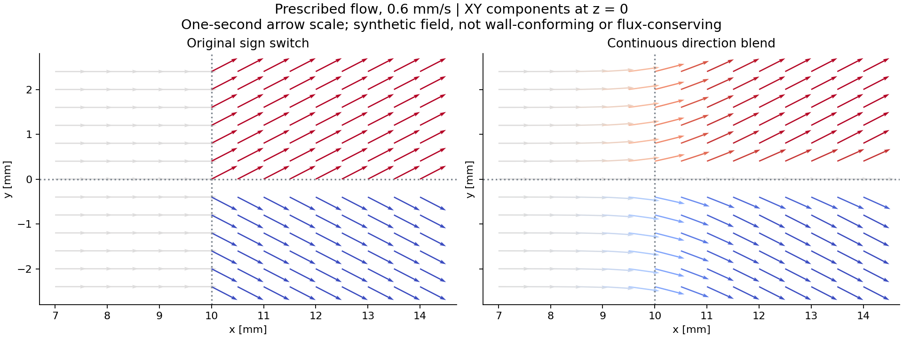
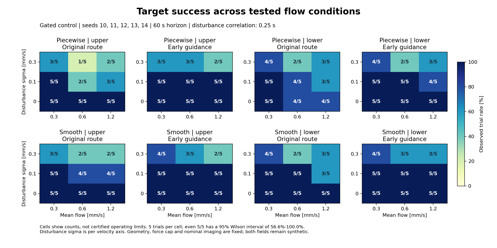

# Flow-model and disturbance sensitivity

Early branch guidance still improves some matched trials when the discontinuous
flow switch is replaced by a continuous direction blend. It does not eliminate
failures under strong persistent disturbances. The study ran 360 trials across
two synthetic fields, three mean speeds, three disturbance levels, both target
branches, two routes and five seeds. These are sampled performance maps, not
certified operating ranges or evidence of realistic vascular flow.

## Models and controlled comparison



The original field is unchanged: before x = 10 mm it points along +x;
afterwards y >= 0 selects upper flow and y < 0 selects lower flow.

The new field uses `a = (1 + tanh((x - 10 mm) / L)) / 2` and
`b = tanh(y / W)`. It normalizes `[1, 0.6*a*b, 0.3*a*b]` and multiplies by
the prescribed speed. This study fixes `L = 1 mm` and `W = 0.3 mm`.
It changes both the longitudinal transition and lateral selection, so model
differences cannot be attributed to only one of these changes.

The smooth model removes the upper-branch tie-break at y = 0: that streamline
continues straight. It can point through the space between outlet capsules.
Neither field enforces wall boundary conditions, incompressibility or conserved
bifurcation flux. Continuity is a numerical/modeling property here, not a claim
that the new field is physically validated. See
[the equations and assumptions](02_low_reynolds_flow.md).

| Setting | Fixed value or tested values |
|---|---|
| Seeds | 10, 11, 12, 13, 14; not used to choose the approach offset |
| Mean prescribed speed | 0.3, 0.6, 1.2 mm/s |
| Disturbance standard deviation | 0, 0.1, 0.3 mm/s per velocity axis |
| Disturbance correlation time | 0.25 s |
| Branches | Upper and lower |
| Routes | Original, and fixed 0.4 mm early-guidance offset |
| Controller | Existing gated proportional controller; 3 nN force cap |
| Imaging | Nominal 20 Hz, 50 ms latency, 1 px noise; no dropout |
| Horizon / timestep | 60 s / 5 ms |

Positive-correlation disturbances follow a stationary Gaussian
Ornstein-Uhlenbeck process, sampled exactly at physics timestamps and held
over the next integration interval. The first sample is stationary, rather
than starting at zero. Sigma is per axis; it is not a bound on vector magnitude.
The disturbance is synthetic, unbounded and may reverse a velocity component.
The legacy independent-per-tick process remains available with correlation
time zero and preserves the old random draws.

Seeds, sensor settings and disturbance draws are paired across routes. All
matched route configurations differ only in `approach_offset_m`. Geometry,
controller settings and the selected field are otherwise unchanged. The 60 s
horizon reduces slow-flow timeouts; this study is not directly interchangeable
with the previous 40 s pilot or its different imaging-stress scenarios.

## Success maps



The bottom row is the continuous field. Each cell has only five trials.
Every continuous-field early-guidance cell at sigma 0 or 0.1 mm/s reached
5/5 success, for both branches and all three tested speeds. This is evidence
that the observed guidance benefit is not confined to the original hard
sign switch, but five successes still have a 95% Wilson interval of
approximately 56.6%-100%.

At sigma 0.3 mm/s, the guided continuous-field counts were:

| Mean flow mm/s | Upper target | Lower target |
|---:|---:|---:|
| 0.3 | 4/5 | 4/5 |
| 0.6 | 3/5 | 3/5 |
| 1.2 | 2/5 | 3/5 |

Guidance has clear limits in this stronger-disturbance regime. The grid is
too small to locate a sharp failure threshold or justify interpolation
between cells as a reliable operating boundary.

## Matched changes and failure types

There are 90 matched original/guided cases per field. Guidance rescued 11
piecewise-field cases and seven continuous-field cases, with no observed
success-to-failure changes. Matching aggregate rates can still hide changes
in wrong-branch flags or terminal geometry; the raw records retain these.

The table below is bookkeeping across heterogeneous grid conditions, not a
pooled success-probability estimate.

| Field | Route | Successful trials / 90 | Capsule sidewall proxy | Closed outlet cap proxy | Timeout |
|---|---|---:|---:|---:|---:|
| Piecewise | Original | 65 | 11 | 13 | 1 |
| Piecewise | Early guidance | 76 | 7 | 6 | 1 |
| Continuous | Original | 72 | 10 | 7 | 1 |
| Continuous | Early guidance | 79 | 6 | 5 | 0 |

[Wrong-branch map](figures/flow_sensitivity_wrong_branch.png) and
[wall-proxy map](figures/flow_sensitivity_wall_collision.png) separate those
events from target success. Wrong-branch flags can overlap wall violations
or timeouts. Timeout means reaching the horizon without success or a wall
termination. Terminal labels remain conservative capsule-feature diagnostics,
not exact surface-contact measurements.

## Holding capacity is not navigation capacity

The logged flow is the actual disturbed velocity used over the next integration
interval. A diagnostic computes the ideal force required to cancel it:
`holding_force = gamma * norm(actual_flow)`. The following undisturbed values
use the unchanged 0.1 mm particle radius and 3.5e-3 Pa s viscosity.

| Mean speed mm/s | Force required to hold still nN | Within 3 nN cap? |
|---:|---:|---|
| 0.3 | 1.98 | Yes |
| 0.6 | 3.96 | No |
| 1.2 | 7.92 | No |

The equivalent maximum cancellation speed is approximately 0.455 mm/s.
Nevertheless, guided trials with no disturbance reached the requested branch
at every tested speed. Downstream advection can assist navigation even when
station keeping is impossible.

JSON records include the interval-duration-weighted fraction of holding demand
above the force cap and the applied-force saturation fraction. These use true
flow for retrospective evaluation only; they do not enter the controller.
Time samples are correlated, so no sample-level binomial confidence interval
is calculated. The terminal flow sample is NaN because there is no next
integration interval and is excluded from these metrics.

For example, guided lower-target continuous-field trials at 1.2 mm/s with
sigma 0.1 mm/s had holding demand above the cap throughout the recorded
intervals but still achieved 5/5 success. At sigma 0.3 mm/s, success fell to
3/5 and mean force-saturation time was about 2.9%. A high holding-demand
fraction alone does not explain every navigation failure or show that the
controller was continuously saturated.

The [holding-demand map](figures/flow_sensitivity_flow_holding_limit_exceeded_fraction.png)
shows the mean fraction of integration time above the force cap. The
[safety-gate map](figures/flow_sensitivity_safety_stop_rate.png) separately shows
the mean stopped-sample fraction. Both average trial-level diagnostics; they
are not probabilities of navigation failure.

## Reproduction and evidence

```bash
python -m pytest -q
python -m simulations.11_flow_sensitivity --model piecewise
python -m simulations.11_flow_sensitivity --model smooth
python -m simulations.12_flow_sensitivity_figures
```

The two runs save separate JSON and Markdown files under
`outputs/11_flow_sensitivity`; the plot command reads those files without
rerunning simulations. Every JSON contains full trial configurations and
summaries, terminal features, Wilson intervals for binary outcomes and
trial-level continuous-metric distributions. Successful arrival times exclude
failed trials; each metric includes its valid trial count.

- [Piecewise result table](results/flow_sensitivity/piecewise.md) and
  [complete records](results/flow_sensitivity/piecewise.json).
- [Continuous-field result table](results/flow_sensitivity/smooth.md) and
  [complete records](results/flow_sensitivity/smooth.json).
- [Matched rescued/regressed case identities](results/flow_sensitivity/paired_changes.json).

Programmatic example:

```python
from src.experiment import TrialConfig, run_trial

result = run_trial(TrialConfig(
    branch="lower", duration_s=60, approach_offset_m=0.4e-3,
    flow_model="smooth", flow_speed_m_s=0.6e-3,
    flow_disturbance_m_s=0.1e-3, flow_correlation_s=0.25,
))
```

## Verification and next limitation

All 95 tests passed. Checks cover continuity at both old switch boundaries,
speed and branch symmetry, stationary disturbance variance/correlation,
legacy independent draws, exact archived-trial reproduction, interval-aligned
flow logging, deterministic replay, invalid settings and trial aggregation.
All 360 force maxima remained within 3 nN. Matched configurations and terminal
outcome accounting were verified. Plot layout and field directions were
visually inspected. Runtime: Python 3.12.11, NumPy 2.3.3, Matplotlib 3.10.6.

The next controller investigation should address persistent flow uncertainty
and short-horizon wall approach, while retaining these two model baselines.
This study does not establish that a particular estimator or predictive
controller would solve the failures. Further physical-model work is still
needed: wall-compatible junction flow, flux conservation, parameter provenance
and broader geometry are not implemented by smoothing alone.
