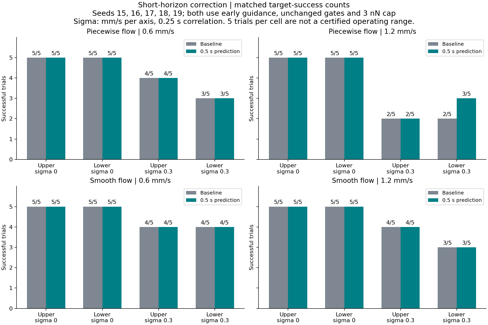
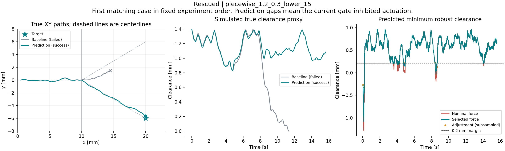
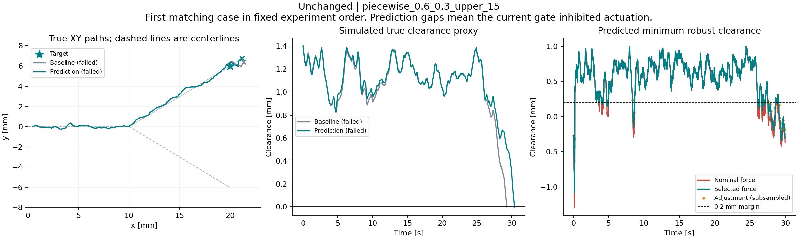

# Short-horizon force correction

The optional prediction layer can redirect force before the reactive wall gate
would inhibit actuation. In 160 fixed held-out trials, it rescued one matched
piecewise-flow failure and changed no continuous-flow success outcomes. There
were no success-to-failure changes, newly introduced wall violations or newly
introduced wrong-branch events. This is limited evidence; the option remains
disabled by default and strong-disturbance failures persist.

## Method and control boundary

Both policies retain the 0.4 mm early branch guidance, the same waypoint force,
force cap and current-state safety gates. The only trial configuration difference
is `prediction_horizon_s`: zero for baseline, 0.5 s for prediction.

At each allowed control tick, predict candidate motion from the image-based
state estimate using a nominal drag coefficient:

```text
gamma_model = 6 * pi * 3.5e-3 Pa s * 0.1e-3 m
v_candidate = estimated_velocity + (candidate_force - previous_command) / gamma_model
p_candidate(tau) = estimated_position + tau * v_candidate
tau = 0, 0.1, 0.2, 0.3, 0.4, 0.5 seconds
```

The previous command is the last command emitted by navigation, including zero
when a gate stopped actuation. Estimated velocity already contains past control
effects, so adding the entire candidate force without subtracting the previous
command would count an actuation contribution twice. This subtraction remains
an approximation: the existing image-based velocity filter lags changes in
command and flow. It is not a calibrated disturbance observer, and it does not
know the plant's optional actuation gain error.

For each future time, propagate the existing six-state covariance:

```text
P_position(tau) = P_pp + tau * (P_pv + P_vp) + tau^2 * P_vv + q * tau^3 / 3 * I
robust_clearance(tau) = capsule_union_proxy(p_candidate(tau))
                        - 3 * sqrt(largest_eigenvalue(P_position(tau)))
q = 1e-7 m^2/s^3
```

This includes position-velocity cross covariance, velocity uncertainty and the
same acceleration spectral density as the estimator. It does not calibrate a
collision probability or account for all drag, flow and geometry errors.

Candidate generation is deliberately small. Project the nominal predicted
endpoint onto the nearest inlet or intended-branch centerline. Construct the
bounded force that would move that endpoint toward the projection, then test
the nominal force, 25/50/75/100 percent blends toward that correction, and zero
force. All candidates lie within the existing force ball. Evaluate clearance
against the whole capsule union, without advancing the waypoint planner during
prediction. Prefer the smallest change from nominal whose minimum sampled
robust clearance is at least 0.2 mm. If no candidate meets the margin, use the
one with the greatest minimum clearance and log the remaining violation.

The predictor is called only after the current gate permits actuation. Missing
or stale tracking, excess uncertainty and low current robust wall margin still
produce exactly zero force. Zero force leaves fluid advection in place. The
controller is recomputed every 5 ms; the constant-force paths are hypothetical
predictions, not commands held for the full 0.5 s.

The implementation is a finite-candidate heuristic, not MPC, a control barrier
function or a continuous-time safety constraint. Five future samples can miss
between-sample contact. Both flow models and the capsule geometry remain toy
models with the limitations described in [the flow study](10_flow_sensitivity.md).

## Fixed held-out comparison

| Setting | Value |
|---|---|
| Seeds | 15, 16, 17, 18, 19; no parameter selection on these results |
| Prescribed fields | Piecewise and continuous blend |
| Mean flow | 0.6 and 1.2 mm/s |
| Disturbance sigma | 0 and 0.3 mm/s per velocity axis |
| Disturbance correlation | 0.25 s |
| Branch / early-guidance offset | Both targets / 0.4 mm |
| Controller | Existing gated control, correction off/on |
| Prediction | Fixed 0.5 s horizon, five future samples |
| Imaging | 20 Hz, 50 ms delay, 1 px noise; no dropout |
| Force cap | 3 nN |
| Trial horizon / integration step | 60 s / 5 ms |

There are 40 pairs per field and 160 executions in total. Random streams,
geometry, observations settings and flow settings are matched; realized image
positions diverge when commands change the path. Parameters were fixed before
running this grid and were not tuned afterward. This experiment does not cover
the previous study's 0.3 mm/s flow or 0.1 mm/s disturbance level.



Every cell contains only five trials. A 5/5 result has a 95% Wilson interval of
approximately 56.6%-100%; these are not operating-range guarantees. Per-cell
intervals are included in the JSON. Results with new seeds must not be compared
as a causal before/after change against the older seeds 10-14.

The following totals are bookkeeping across heterogeneous cells, not estimates
of a pooled success probability:

| Field | Policy | Success / 40 | Sidewall proxy | Closed outlet cap proxy | Wrong branch | Timeout |
|---|---|---:|---:|---:|---:|---:|
| Piecewise | Baseline | 31 | 5 | 4 | 5 | 0 |
| Piecewise | Prediction | 32 | 4 | 4 | 4 | 0 |
| Continuous | Baseline | 35 | 1 | 4 | 1 | 0 |
| Continuous | Prediction | 35 | 1 | 4 | 1 | 0 |

Wrong-branch flags can overlap wall violations. Terminal wall labels are
conservative capsule features, not exact union-surface contact classifications.
There was one rescued pair and zero regressed pairs in the piecewise field,
and zero of either in the continuous field. No pair acquired a new wall or
wrong-branch flag. Prediction adjusted the nominal force on a mean of 4.90%
and 3.52% of logged samples per trial in the piecewise and continuous fields,
respectively. The corresponding mean stopped-sample fractions changed from
2.44% to 1.28% and 0.79% to 0.57%. Lower stop fractions alone do not establish
safer navigation. These are descriptive trial means, not independent time-sample
probabilities; startup and terminal samples are included.

Minimum true clearance did not improve in every pair. Using 1 micrometre as a
descriptive reporting threshold, it decreased by more than that amount in 9/40
piecewise pairs and 8/40 continuous pairs; the largest decreases were 4.86 and
7.95 micrometres. Thus, the absence of new binary failures is not evidence of
uniformly improved clearance. Every evaluated selected candidate had a sampled
predicted minimum at least as large as nominal, but that internal comparison
does not guarantee a better realized trajectory.

## Improvement and remaining failure

The example selection rule is fixed: the first rescued, first regressed and
first unchanged failed pair in experiment order, omitting categories with no
matches. No regressed pair was available in this run.



At 1.2 mm/s, sigma 0.3 mm/s, lower target, seed 15, the piecewise baseline
entered the wrong branch and terminated at a sidewall proxy violation. The
prediction variant reached the requested lower target. The plots show simulated
truth for evaluation and the predictor's internal minimum robust clearance.
This single rescue does not establish that the same correction is reliable
for other random disturbances or physical fields.



At 0.6 mm/s, sigma 0.3 mm/s, upper target, seed 15, both piecewise-field policies
failed at the closed outlet cap proxy. Steering corrections did not eliminate
the terminal miss. Selected-force prediction values below the dashed margin mean none of the
sampled candidates met the requested margin. Gaps mean the current gate
inhibited actuation or no estimate was available, not zero predicted risk.
In particular, early predictions can be pessimistic because velocity covariance
is large before several observations have arrived.

## Reproduction and verification

```bash
python -m pytest -q
python -m simulations.13_predictive_control --model piecewise
python -m simulations.13_predictive_control --model smooth
python -m simulations.14_predictive_figures
```

For an individual trial, use `TrialConfig(prediction_horizon_s=0.5)` with
`run_trial`; `prediction_horizon_s=0` preserves baseline behavior. Positive
horizons require gated control. The predictor's nominal viscosity is configured
at the navigation boundary; it is not read from the running particle.

The experiment saves every trial history under `outputs/13_predictive_control/traces`
and full configurations, summaries, pair identities and aggregates in JSON.
`prediction_adjusted_fraction` uses all logged samples;
`prediction_infeasible_fraction` uses only samples where prediction was evaluated
and is null when disabled. Each record also stores the evaluated-sample count.
These diagnostics are not time-weighted event probabilities.

- [Per-cell comparison](results/predictive_control/comparison.md).
- [Piecewise records and pairs](results/predictive_control/piecewise.json).
- [Continuous records and pairs](results/predictive_control/smooth.json).
- [Deterministically selected replay identities](results/predictive_control/replay_examples.json).

All 109 tests passed. Tests cover anticipatory inward correction, preservation of centered motion,
force bounds, infeasible predictions, velocity covariance, previous-command
accounting, intermediate path samples, tracking and wall stops, invalid options
and deterministic replay. The archived legacy trial remains exactly reproducible.
All 160 runs respected the force cap and produced exactly zero force for the
three current-gate stop reasons. Pair configuration equality and terminal outcome
accounting were checked. The comparison and replay figures were visually inspected.

The limited gain suggests that adding this heuristic alone is insufficient.
A subsequent investigation should measure prediction error around command
changes and persistent flow, then test control-input-aware velocity/flow
estimation on separate seeds. Formal constraints, swept-contact checking and
physically validated junction flow remain outside this implementation.
