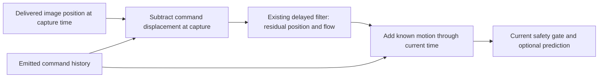
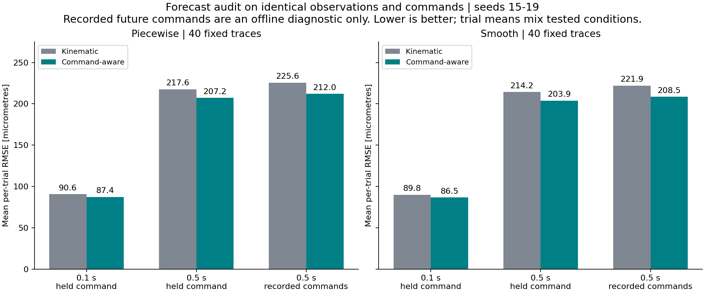
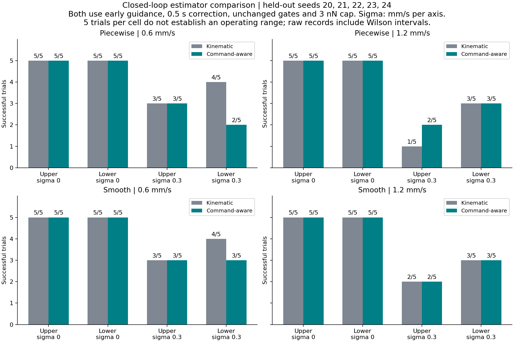
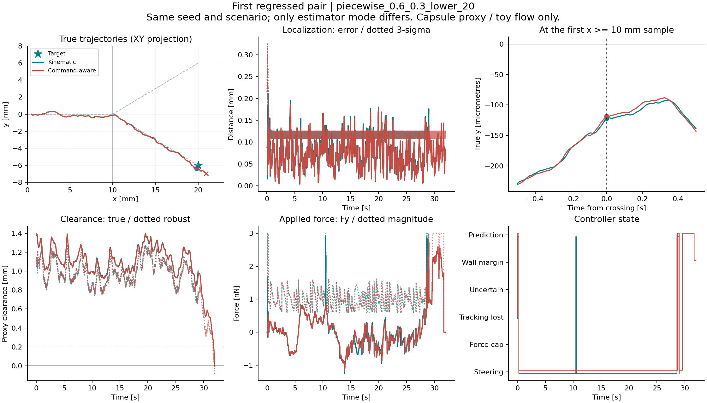

# Command-aware estimation: better forecasts, worse held-out navigation

Removing known command displacement before filtering improves the mean forecast
error on identical archived trajectories. It does not improve navigation in the
first held-out closed-loop comparison: one failure became a success, but three
successes became failures. The default remains the original kinematic estimator;
the new estimator and short-horizon correction remain explicit experimental
options. All numerical parameters and geometry are still toy models.

## Command-aware estimator

Define the known displacement due to emitted commands under nominal Stokes drag:

```text
A(t) = integral from 0 to t of F_command(s) / gamma_model ds
gamma_model = 6 * pi * 3.5e-3 Pa s * 0.1e-3 m
r(t) = p(t) - A(t)
```

Commands are piecewise constant. At an image's capture timestamp, subtract
`A(capture_time)` from the reconstructed position. Apply the existing delayed
six-state filter to residual position `r` and velocity `u`. With exact nominal
actuation, this residual velocity corresponds to flow. At the current time,
return `estimated_position = estimated_r + A(now)` and
`estimated_velocity = estimated_u + previous_command / gamma_model`.

The initial flow prior is zero, with the existing velocity uncertainty. No true
position or flow initializes the filter. Frame handling, random/calibration
covariance, process spectral density `q = 1e-7 m^2/s^3` and other priors are
unchanged. Known coordinate translations leave the covariance unchanged.
Unknown drag, force gain and coil dynamics are not incorporated into that
covariance. The command history contains emitted commands, including gate-stop
zeros, rather than true applied force. It is retained for the duration of a trial.

Capture-time integration matters: a force change between capture and delivery
must not be subtracted from the older observation. Current estimates add back
the command displacement accrued through the requested time. The predictor then
subtracts the previous command from estimated velocity, as before, and adds each
candidate force. In command-aware mode this uses the residual flow estimate.



`BiplaneNavigation.step` still accepts only time and delivered frames. All true
flow and trajectory comparisons below occur in evaluation code, outside control.

## Fixed-trace forecast audit

Experiment 15 replays the 80 prediction-enabled histories from experiment 13:
seeds 15-19, two fields, two speeds, zero/strong disturbance and both branches.
Both estimators receive exactly the same regenerated camera observations and
emitted commands. The reconstructed legacy position estimates match their
archived values within 1e-15 m, checking replay alignment. The shadow estimator
cannot change the archived commands, trajectory or outcome.

At every tenth 5 ms physics sample after the first second, score 0.1 s and 0.5 s
forecasts if an exact future timestamp exists before termination. No endpoint
is extrapolated after a trial ends. This excludes the final horizon of each
trial and the startup interval; failures have shorter scoring windows. Valid
sample counts are stored for every metric.

Two trajectory diagnostics distinguish command changes from estimated drift:

```text
u_hat = estimated_velocity - previous_command / gamma_model
held-command forecast = p_hat + horizon * (u_hat + current_command / gamma_model)
recorded-command diagnostic = p_hat + horizon * u_hat
                              + integral of recorded future commands / gamma_model
```

The held-command forecast is compared with the realized closed-loop path,
which can change commands during the horizon. Its error is therefore not a pure
flow-model error. The recorded-command version accounts for those subsequent
commands retrospectively; future commands are never passed to navigation or
used by the online predictor. It can have a higher error than the held-command
version because future feedback corrections and flow-estimation errors can
partly cancel. No ordering between these two errors is guaranteed.



Values below are means of per-trial 3D RMSE, with equal trial weights. They mix
the tested conditions and are descriptive, not population estimates.

| Field | 0.5 s diagnostic | Kinematic, micrometres | Command-aware, micrometres |
|---|---|---:|---:|
| Piecewise | Held command | 217.6 | 207.2 |
| Piecewise | Recorded commands | 225.6 | 212.0 |
| Continuous | Held command | 214.2 | 203.9 |
| Continuous | Recorded commands | 221.9 | 208.5 |

The recorded-command mean falls about 6% in both fields; held-command error
falls about 4.8%. In the predefined recent-command-change subset (current
command differs by at least 0.5 nN from 0.1 s earlier), the 0.5 s recorded-command
means change from 233.5 to 213.7 micrometres and from 229.4 to 210.1 micrometres,
about 8.5% improvements. Trials with no eligible samples contribute null rather
than zero. Correlated forecast samples are not treated as independent trials.

At the eligible 0.5 s start samples, mean per-trial instantaneous 3D flow RMSE
changes from 0.362 to 0.342 mm/s for piecewise flow and from 0.355 to 0.334 mm/s
for continuous flow. Significant flow uncertainty remains. Neither mean
forecast improvement nor a covariance margin is a collision guarantee.

## Independent closed-loop comparison

Experiment 16 uses new seeds 20-24 and changes only `estimator_mode` within
each pair. Both modes use 0.4 mm early branch guidance, 0.5 s prediction, the
same current-state gates, 3 nN cap and observation settings. The grid is two
fields, mean speeds 0.6/1.2 mm/s, disturbance sigma 0/0.3 mm/s per velocity axis,
0.25 s disturbance correlation, both branches and five seeds: 80 matched pairs,
160 runs. Each trial has a 60 s limit and 5 ms integration step, with 20 Hz
imaging, 50 ms latency and 1 px noise. No dropout is used in this outcome grid.
Parameters were fixed before the new-seed run and were not tuned afterward.



Each cell has five trials, with conditional Wilson intervals in the JSON. Even
5/5 has a 95% Wilson interval of approximately 56.6%-100%. The following totals
are bookkeeping across heterogeneous cells, not pooled success probabilities.

| Field | Estimator | Success / 40 | Sidewall proxy | Closed outlet cap proxy | Wrong branch |
|---|---|---:|---:|---:|---:|
| Piecewise | Kinematic | 31 | 4 | 5 | 7 |
| Piecewise | Command-aware | 30 | 4 | 6 | 6 |
| Continuous | Kinematic | 32 | 3 | 5 | 5 |
| Continuous | Command-aware | 31 | 3 | 6 | 5 |

There were no timeouts. Wrong-branch flags can overlap wall events. Piecewise
flow has one rescued pair and two regressed pairs; continuous flow has zero
rescues and one regression. All three regressions introduced a closed-outlet
cap proxy violation, with no new wrong-branch flags. Minimum true clearance
decreased by more than 1 micrometre in 13/40 pairs in each field; worst paired
decreases were about 0.845 and 0.844 mm, including the new failures. These
outcomes do not support promoting the estimator to the default controller.

## Regression replay and terminal sensitivity

The replay below is the first regressed pair in fixed experiment order:
piecewise flow, 0.6 mm/s, sigma 0.3 mm/s, lower target, seed 20.



Both trajectories select the intended lower branch. The kinematic run reaches
the 0.4 mm target sphere at 29.01 s. The new estimator's closest approach is
0.419 mm at 29.175 s; it misses the target sphere, continues downstream and
terminates at the capsule's closed outlet cap at 32.005 s. Its overall position
RMSE is slightly lower (79.4 versus 82.3 micrometres), despite failing the task.

The other regressions also narrowly miss the same unchanged target criterion:
piecewise lower seed 21 reaches a minimum distance of 0.403 mm, and continuous
lower seed 20 reaches 0.426 mm. All use 0.6 mm/s flow and strong disturbance.
This identifies sensitivity near the terminal target; it does not isolate one
specific estimator or controller mechanism as the sole cause. Better terminal
guidance needs a separate test, including the fixed force cap and ongoing flow.
The target radius and success criterion were not changed after seeing these results.

## Reproduction, artifacts and verification

```bash
python -m pytest -q
# Regenerate the ignored source histories if they are not already present.
python -m simulations.13_predictive_control --model piecewise
python -m simulations.13_predictive_control --model smooth
python -m simulations.15_estimation_audit --model piecewise
python -m simulations.15_estimation_audit --model smooth
python -m simulations.16_flow_estimator_comparison --model piecewise
python -m simulations.16_flow_estimator_comparison --model smooth
python -m simulations.17_estimation_figures
```

An individual run can use
`TrialConfig(estimator_mode="command_aware", prediction_horizon_s=0.5)`.
The default estimator is `kinematic` and the default prediction horizon is zero.
Histories now include `estimated_velocity_m_s`, evaluated before issuing the
current command, in addition to existing positions, force and prediction logs.

- [Fixed-trace piecewise audit](results/flow_estimation/audit_piecewise.json) and
  [continuous audit](results/flow_estimation/audit_smooth.json).
- [Closed-loop piecewise records](results/flow_estimation/closed_loop_piecewise.json)
  and [continuous records](results/flow_estimation/closed_loop_smooth.json).
- [Per-cell paired comparison](results/flow_estimation/comparison.md) and
  [descriptive outcome summary](results/flow_estimation/summary.json).
- [Regression identities and closest approaches](results/flow_estimation/regression_details.json).

All 116 tests passed. New checks cover exact command integration across delayed
capture/delivery, constant-flow recovery under reversing commands, invalid
timestamps and settings, no truth initialization, deterministic replay, gate
stops and separation of future-command changes in the offline audit. Existing
archived baseline reproduction remains intact. All 160 new trials respected
the 3 nN force cap and exactly zero force for current-gate stop reasons. Matched
configuration equality and terminal outcome accounting were verified. The
forecast, outcome and regression plots were visually inspected.

The next focused experiment should address terminal target approach and
evaluate whether predicted target miss can be reduced without sacrificing wall
clearance. Calibration of flow/input uncertainty, physical junction flow and
continuous-time collision checking remain unresolved.
