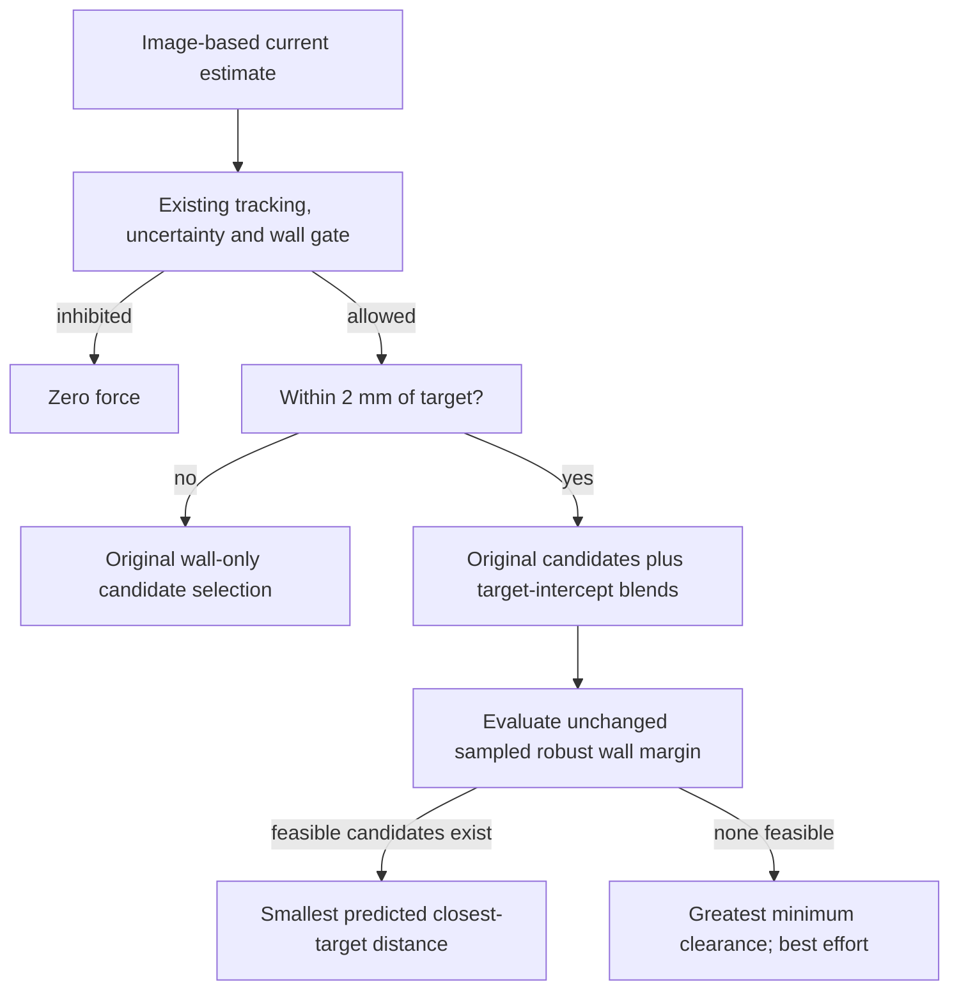
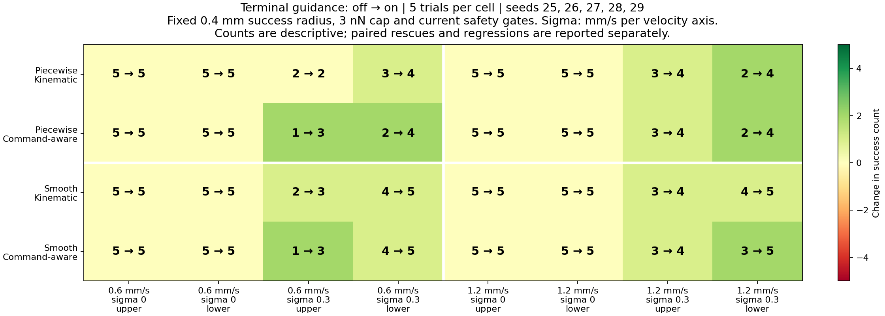
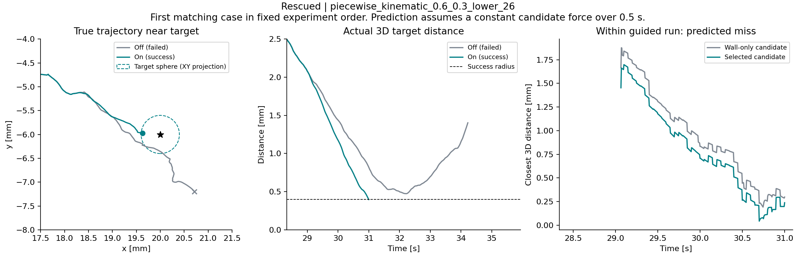
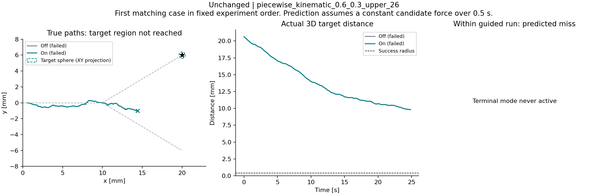

# Terminal target guidance

In 320 held-out runs, terminal guidance rescued 21 matched failures with no
success regressions or new wall violations. Each trial's minimum true clearance
was unchanged or improved. All three previously identified target-miss
regressions also succeeded in separate replays. These findings apply to the
fixed toy scenarios, not a certified operating range.

The optional terminal policy adds target-intercept force candidates near the
selected endpoint, while retaining the existing current-state safety gates,
sampled robust wall margin and force cap. It is evaluated against terminal
guidance off with both estimator baselines. The success criterion remains a
sampled true 3D distance of at most 0.4 mm, with no prior wrong-branch or wall
violation. The option remains disabled by default.

## Method

When the estimated particle position is within 2 mm of the selected target
and the current safety gate allows actuation, retain the original six force
candidates and add four blends toward a target intercept. With the unchanged
0.5 s prediction horizon, define:

```text
u_hat = estimated_velocity - previous_command / gamma_model
F_intercept = limit(gamma_model * ((target - estimated_position) / 0.5 s - u_hat), 3 nN)
F_added(w) = F_nominal + w * (F_intercept - F_nominal)
w = 0.25, 0.5, 0.75, 1.0
```

The original nominal waypoint force is already bounded. These convex blends
therefore remain inside the same force ball. The estimated flow and nominal
Stokes drag are the same as those used by the existing predictor. True position,
flow and actuation gain are not controller inputs. Outside the terminal region,
the original candidate set and selection rule remain in effect.

Predict each candidate's constant velocity using the existing estimate and
nominal drag. Evaluate the same conservative capsule-union clearance proxy at
the current time and five future times through 0.5 s, subtracting the propagated
largest-axis three-sigma position margin. A candidate is feasible here only if
its minimum sampled robust clearance is at least 0.2 mm.

Among feasible candidates, choose the smallest predicted closest target
distance over the horizon. For candidate velocity `v_c`, compute this closest
approach analytically along the constant-velocity line:

```text
t_closest = clip(dot(v_c, target - p_hat) / dot(v_c, v_c), 0, horizon)
miss = norm(p_hat + t_closest * v_c - target)
```

A zero-speed candidate uses `t_closest = 0`. Equal target distances are broken
by the smaller change from nominal force. If no candidate is feasible, select
the candidate with greatest minimum predicted wall clearance, as before; do
not label that fallback safe or target-reaching. Wall feasibility takes priority
over target proximity. A feasible target-oriented candidate may have lower
predicted clearance than the wall-only selection while still meeting the margin.

The closest-target score is deterministic and is not inflated by covariance.
It is not an arrival probability or a guarantee that the real trajectory enters
the target sphere. Commands are recomputed every 5 ms rather than held for the
entire hypothetical horizon. Wall checks remain sampled, and prediction error,
flow uncertainty and capsule-geometry limitations remain present.



## Fixed held-out design

| Setting | Value |
|---|---|
| Seeds | 25, 26, 27, 28, 29 |
| Estimators | Kinematic and command-aware |
| Terminal guidance | Off / on within 2 mm of estimated target proximity |
| Prediction / early guidance | 0.5 s / 0.4 mm pre-junction offset for both policies |
| Flow fields | Piecewise and continuous blend |
| Mean flow | 0.6 and 1.2 mm/s |
| Disturbance sigma | 0 and 0.3 mm/s per velocity axis |
| Disturbance correlation time | 0.25 s |
| Branches | Upper and lower |
| Imaging | 20 Hz, 50 ms latency, 1 px noise; no dropout |
| Trial horizon / step | 60 s / 5 ms |
| Force cap / target radius | 3 nN / 0.4 mm, unchanged |

There are 40 pairs for each field/estimator combination, 160 pairs and 320 runs
overall. Matched configurations differ only in terminal-guidance distance.
Random streams are paired, although observations of position diverge once
commands change the physical trajectory. The method and parameters were fixed
before these new-seed runs and were not tuned after their outcomes.

## Held-out outcomes



Each cell contains five trials. Even 5/5 has a conditional 95% Wilson interval
of approximately 56.6%-100%; per-cell intervals are included in the raw JSON.
The totals below combine heterogeneous grid cells for bookkeeping and are not
pooled probability estimates. Repeated seeds across fields and estimators do
not create independent replications.

| Field | Estimator | Success off → on / 40 | Rescued | Regressed | Sidewall off → on | Closed cap off → on | Wrong branch off → on |
|---|---|---:|---:|---:|---:|---:|---:|
| Piecewise | Kinematic | 30 → 34 | 4 | 0 | 4 → 4 | 6 → 2 | 6 → 6 |
| Piecewise | Command-aware | 28 → 35 | 7 | 0 | 3 → 3 | 9 → 2 | 5 → 5 |
| Continuous | Kinematic | 33 → 37 | 4 | 0 | 2 → 2 | 5 → 1 | 3 → 3 |
| Continuous | Command-aware | 31 → 37 | 6 | 0 | 2 → 2 | 7 → 1 | 3 → 3 |

No trial timed out. Wrong-branch flags overlap wall failures. All 21 rescues
were formerly closed-outlet-cap violations. There were no newly introduced wall
or wrong-branch flags, and no decrease in the per-trial minimum true clearance
in any of the 160 pairs. This metric is a whole-trial minimum rather than a
pointwise comparison of the two paths. Sidewall-proxy counts did not improve.

All 17 remaining guided failures had a latched wrong-branch event. This limited
terminal policy does not address earlier branch selection; none of these cases
reached the selected target's activation region. That observation is confined
to this grid and does not establish that every correctly routed trajectory will
reach the target under other disturbances, imaging settings or geometries.

### Example rescue and remaining failure

Replay selection is deterministic: the first rescued, first regressed and
first unchanged failed pair in experiment order, omitting absent categories.
No regressed pair was available in this run.



For piecewise flow, kinematic estimation, 0.6 mm/s, sigma 0.3 mm/s, lower target,
seed 26, the baseline missed the target by a minimum distance of 0.474 mm and
hit the closed outlet cap at 34.225 s. Terminal guidance entered the unchanged
0.4 mm target sphere at 31.0 s. The right panel compares candidates at the
guided run's own current estimate; it is an internal prediction diagnostic.
The XY target disk is a projection of the 3D sphere, so the middle panel supplies
the actual 3D target-distance check.



The first unchanged failed pair uses the same field, estimator, speed, sigma and
seed, but requests the upper branch. It instead enters the lower branch and
ends with a sidewall-proxy violation at 24.84 s. Terminal mode never activates;
both traces and commands are identical. This is a remaining upstream limitation.

- [Per-cell paired comparison](results/terminal_guidance/comparison.md) and
  [descriptive outcome summary](results/terminal_guidance/summary.json).
- [Piecewise configurations, summaries and pairs](results/terminal_guidance/piecewise.json)
  and [continuous records](results/terminal_guidance/smooth.json).
- [Selected replay identities](results/terminal_guidance/replay_examples.json).

## Known-regression replay

The three previously reported command-aware target misses were replayed with
the new option. All three reached the unchanged target sphere:

| Field | Flow mm/s | Sigma mm/s | Target | Seed | Terminal off | Terminal on |
|---|---:|---:|---|---:|---|---|
| Piecewise | 0.6 | 0.3 | Lower | 20 | Closed outlet cap failure | Success |
| Piecewise | 0.6 | 0.3 | Lower | 21 | Closed outlet cap failure | Success |
| Continuous | 0.6 | 0.3 | Lower | 20 | Closed outlet cap failure | Success |

These are selected known failures, not held-out evidence. They are excluded
from the 320-run comparison. Their original conditions and both summaries
are retained in [the regression-replay records](results/terminal_guidance/known_regressions.json).
The original nearest approaches were 0.403-0.426 mm against the 0.4 mm success
radius; that radius was not relaxed.

## Reproduction and verification

```bash
python -m pytest -q
python -m simulations.18_terminal_guidance --model piecewise
python -m simulations.18_terminal_guidance --model smooth
python -m simulations.19_terminal_figures
```

For an individual run:

```python
from src.experiment import TrialConfig, run_trial

result = run_trial(TrialConfig(
    prediction_horizon_s=0.5,
    terminal_guidance_distance_m=0.002,
    estimator_mode="kinematic",  # Or "command_aware".
))
```

Terminal guidance defaults to zero (off) and requires positive-horizon gated
prediction. The new history fields are `terminal_active`, `terminal_adjusted`,
`baseline_target_miss_m` and `selected_target_miss_m`. The baseline miss is the
original wall-only candidate's prediction at the *guided run's current state*,
not the separate unguided trajectory. Miss values are NaN when inactive or
inhibited. Activity and adjustment fractions in the JSON are fractions of all
logged samples, including startup and terminal samples.

All 129 tests passed, covering lower predicted target miss, wall-margin
feasibility, infeasible fallback, zero-speed candidates, unchanged distant
motion, invalid settings, stop gates and deterministic replay. With terminal
guidance disabled, an archived command-aware predictive trial reproduces its
summary exactly. The tested feature changes the controller, not vessel geometry,
plant dynamics or the success criterion.

All 320 held-out runs respected the force cap and zero-force gate-stop
invariants. Every active sample was within 2 mm of the estimated target
proximity. For all 160 pairs, true positions, estimated positions and commands
were exactly equal before the first terminal activation. Paired configuration
equality and terminal outcome accounting were checked. All three figures were
visually inspected.

Known-regression replays can be reproduced from the saved configurations:

```python
import json
from dataclasses import replace
from pathlib import Path
from src.experiment import TrialConfig, run_trial

cases = json.loads(Path("docs/results/terminal_guidance/known_regressions.json").read_text())
for case in cases:
    config = TrialConfig(**case["baseline"]["config"])
    result = run_trial(replace(config, terminal_guidance_distance_m=0.002))
    assert result["summary"] == case["terminal"]["summary"]
```

The next focused investigation should address the remaining wrong-branch
failures before the junction. The terminal policy stays optional while broader
seeds, imaging stress, flow/model mismatch and other geometries remain untested.
