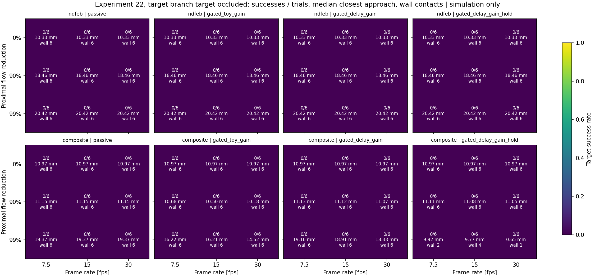

# Closed-loop steering at physiological scale (Step 2)

Computational research and education only. This note reports simulations of a toy
Y-vessel with physiological parameters. It is not a device design, not a safety
claim and not clinical guidance. Every parameter below is sourced or marked
*assumed*.

## Question

docs/14 estimated analytically what cerebral-scale steering needs. Step 2 moved
the simulator itself to that scale. This note asks: **with M1-like flow,
gravity, particle inertia, pulsation and real imaging delay, when can the
existing closed-loop navigation stack reach the selected branch at all?**

## What changed in the simulator (stages 2a–2f)

All options are off by default, so experiments 01–20 reproduce unchanged.

| Stage | Option | Model |
|---|---|---|
| 2a | `max_gradient_t_m` | Force cap `V·M_eff·|∇B|`: a saturated moment, best case |
| 2b | `flow_model="poiseuille"` | `2U(1 − ρ²/R²)` along a smooth junction direction; dt shrinks with speed |
| 2c | `particle_inertia` | Reduced Maxey–Riley: added mass and Schiller–Naumann drag; exact per step |
| 2d | `flow_pulsatility`, `fluid_acceleration_force` | Quasi-steady `1 + A sin`; the `(3/2)m_f Du/Dt` force |
| 2e | `gravity_m_s2`, `sedimentation_check`, `gravity_compensation` | Net weight; a diagnostic flag; an opt-in hold while tracking is valid |
| 2f | `occluded_branch`, `actuation_period_s`, `gain_saturation_distance_m` | Dead-end branch; zero-order-hold actuation; gain from the force cap |

Every physics-enabled trial also reports `closest_target_approach_m`. This
continuous metric sits next to the binary success flag, which uses a 0.4 mm
tolerance.

## Preset (`src/presets.py`)

| Parameter | Value | Provenance |
|---|---|---|
| Lumen radius | 1.5 mm | M1 MRI measurements (docs/14) |
| Mean flow U | 0.30 m/s | TCD mean ~58–60 cm/s, halved for Poiseuille (docs/14) |
| Pulsation A | 0.45 | PI = 2A = 0.9, the midpoint of a reported normal MCA PI of 0.6–1.2 (*Sci Rep* 2020, [doi:10.1038/s41598-020-74056-2](https://www.nature.com/articles/s41598-020-74056-2)). The range comes from a search summary; the full text was not verified. The sinusoidal shape is **assumed** |
| Cardiac period | 1 s | 60 bpm, **assumed** |
| Particle radius | 100 µm | Chosen just above the ~80 µm worst-case minimum at 1 T/m (docs/14) |
| Gradient cap | 1 T/m | Clinical eMNS best case (docs/14); the deliverable value at depth is lower |
| NdFeB M / ρ | 1.0×10⁶ A/m / 7500 kg/m³ | Textbook, **assumed** |
| Composite ρ / NdFeB fraction | 2000 kg/m³ / 0.14 | NdFeB in a ~1100 kg/m³ polymer, **assumed** |
| Blood ρ / η | 1060 kg/m³ / 3.5 mPa·s | **Assumed** (docs/14) |
| Gravity | 9.81 m/s² along −z | Direction in the vessel frame **assumed** |
| Frame rate / latency | 15 fps / 50 ms | **Assumed**; the sweep varies frame rate over 7.5–30 fps |
| Actuation update | 100 Hz, zero-order hold | **Assumed** |
| Toy-equivalent gain | cap / 1.5 mm | Keeps the toy controller's saturation distance, **assumed** |

The imaging model (orthographic biplane, 1 px noise at 50 µm/px) and the safety
gate thresholds are unchanged from the toy platform.

## Experiment 22

`python -m simulations.22_physiological_sweep` runs 864 trials in about 75 s
on 8 cores. The factors are:

- Proximal flow reduction: 0, 90% and 99%, giving U = 0.30, 0.03 and 0.003 m/s.
  Time limits are 0.25, 1 and 5 s, about 1.5× the centerline transit.
- Frame rate: 7.5, 15 and 30 fps.
- Material: pure NdFeB, or the composite.
- Target branch: patent, or occluded (a dead end, with all flow turning into
  the other branch).
- Policy:
  - `passive`: zero force.
  - `gated_toy_gain`: gain k = cap / 1.5 mm.
  - `gated_delay_gain`: `k = 0.5·γ / (latency + 1/fps)`. The fraction 0.5 is
    **assumed**. This sets the closed-loop rate below the observation delay.
  - `gated_delay_gain_hold`: the delay-limited gain plus gravity compensation.
- Target: upper or lower branch, with seeds 0–2.

Every trial starts on the parent axis at x = 0.5 mm. Policies share seeds,
imaging and physics.

Full tables: [report](results/physiological_sweep/report.md). The archived
per-trial records are replayed by `tests/test_physiological_sweep.py`.

### Results

1. **Pure NdFeB never reaches a frame: 0/432 successes** (95% Wilson [0, 0.9%]).
   A 100 µm sphere settles at ~40 mm/s and every trial touches the wall within
   47 ms. The first frame reaches the controller at ~50 ms, so the gate, the
   controller and gravity compensation never act. A 1 T/m cap could hold this
   particle (it needs 0.063 T/m), but the imaging loop is too slow to start.
2. **Without flow reduction nothing succeeds.** At 0.3 m/s every trial ends
   against the wall within ~21–44 ms, whatever the material or policy.
3. **One combination succeeds reliably:** the composite particle at 99% flow
   reduction with the delay-limited gain and gravity hold.
   - It reaches the target in **18/18** patent-target trials (95% Wilson
     [82%, 100%]) at every frame rate tested, in 2.4–3.6 s.
   - It never contacts the wall. The median peak force is only 8–10% of the cap,
     most of it holding against the 39 nN net weight.
   - The same controller without the hold reaches the wall in 18/18 trials.
   - With the toy-equivalent gain it reaches the wall in 18/18 trials, because
     it overshoots on stale estimates.
4. **At 90% reduction only 2/6 succeed,** using the toy gain at 30 fps. The
   other four trials of that cell end at the wall. One of them had passed
   within 0.43 mm of the target, next to the 0.4 mm tolerance, so the binary
   rate is fragile here.
5. **An occluded target is never reached: 0/432**; the closest approach is
   0.61 mm. The dead-end geometry turns every streamline into the patent
   branch. No policy recovers from that.

### Interpretation: authority against delay

The results line up with one trade-off in this proportional controller. A
position error e produces a drift of (k/γ)·e. Stable feedback through a delay
τ_d = latency + 1/fps needs roughly k/γ ≲ 1/τ_d.

- **The delay-limited gain is stable but weak.** It gives 2.7–6.0 mm/s of drift
  per mm of error across 7.5–30 fps. That matches the 99%-reduced centerline
  flow (6–9 mm/s including systole) but is 10× below the 90% flow (60 mm/s).
- **The toy-equivalent gain is strong but unstable.** It gives 59 mm/s per mm,
  enough authority at 90%. But the drift it can produce within one delay,
  (F_cap/γ)·τ_d, is 5–11 vessel radii, so it overshoots on stale estimates and
  hits the wall.

So in this model, proximal flow reduction matters because it brings the flow
speed down to what delay-limited feedback can oppose. A stronger gradient does
not help: it raises the authority, not the rate the delay allows. This agrees
with the analytical conclusion of docs/14, now with the imaging loop included.
It says nothing about controllers designed for delay, such as predictive,
feedforward or model-based schemes. Those were not tested.

## Limitations

- Toy Y geometry: capsules, closed rounded outlets, no mesh. 122 of the 400
  composite wall contacts are the known closed-outlet-cap artifact.
- The flow is not CFD. Streamlines are not wall-conforming, flux is not
  conserved at the split, the occluded branch has no recirculation, and the
  pulsation is quasi-steady although α ≈ 2.1.
- There is no Basset force, no shear-induced lift, no wall-lubrication drag,
  and no red-cell or non-Newtonian effects.
- The gradient cap is a best-case bound with no depth decay or field–gradient
  coupling. The magnetization and densities are assumed.
- The imaging model is idealized orthographic biplane. It has no
  skull/soft-tissue visibility model for a 100 µm particle, which may be the
  harder problem (docs/14).
- The success tolerance (0.4 mm), the gain fraction (0.5), the composite recipe
  and the release point are all choices. The rates are conditional on them.
- The seeds vary only sensor noise and calibration. There are 3 seeds × 2
  branches per cell, so intervals are wide except where outcomes are uniform.
