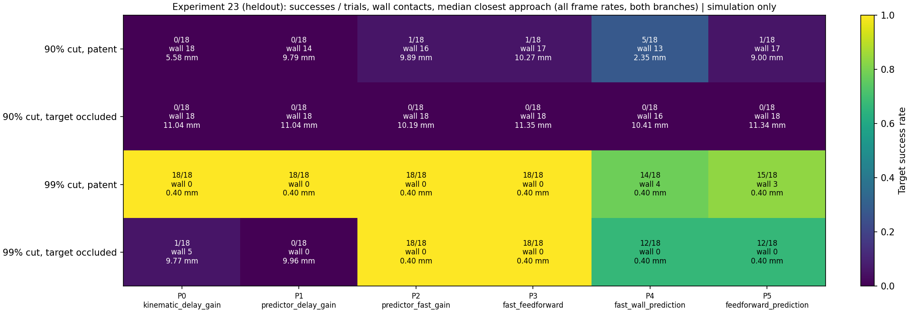
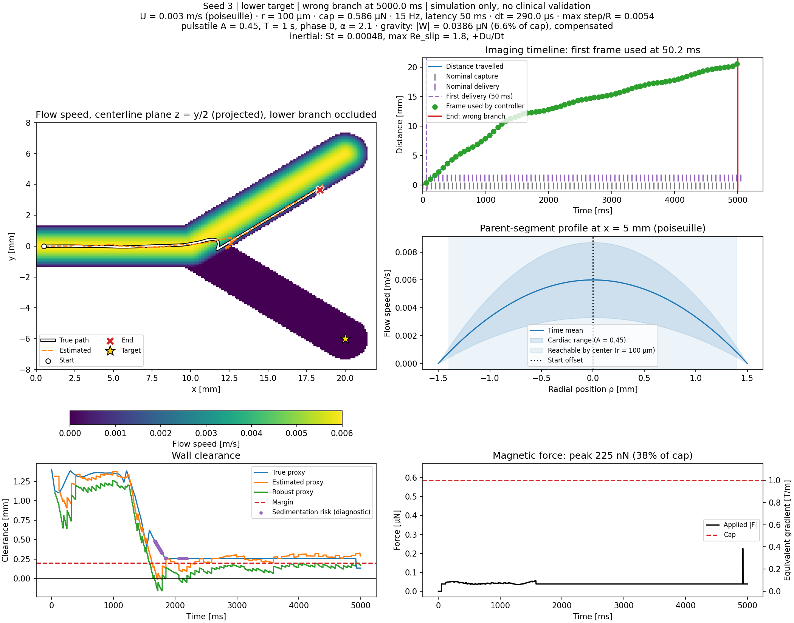
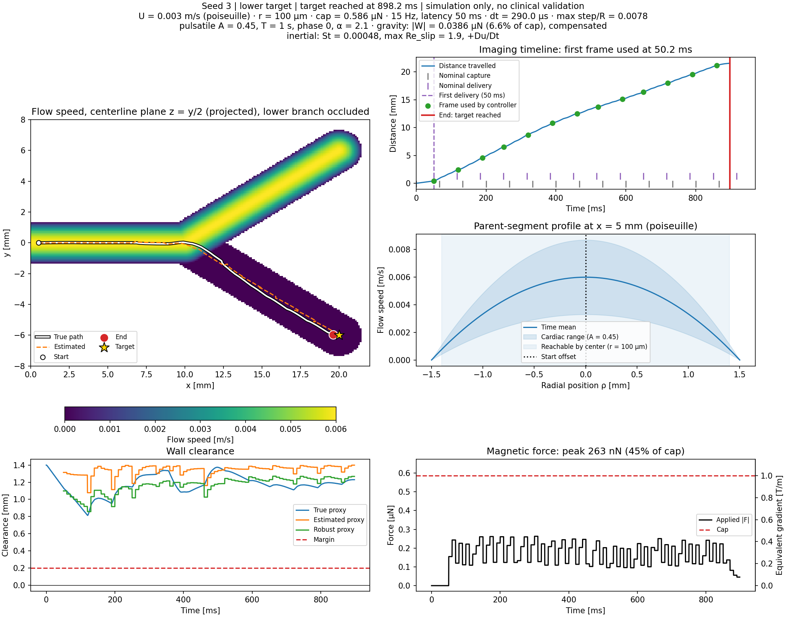

# Delay-aware control at physiological scale (experiment 23)

Computational research and education only. This note compares control policies
in a toy Y-vessel with physiological parameters. It is not a device design, not
a safety claim and not clinical guidance.

## Question

In experiment 22 ([docs/15](15_physiological_sweep.md)), only a delay-limited
proportional gain, `k = 0.5·γ/τ_d`, stayed stable. Here τ_d = latency + frame
period. That gain produces only 2.7–6 mm/s of drift per mm of error, so it
succeeded only at 99% proximal flow reduction and never reached an occluded
target. The toy-equivalent gain was stronger but overshot on stale estimates.
**Does accounting for the delay allow more authority without overshoot?**

## Policies

Every policy uses the composite particle (2000 kg/m³, 14% NdFeB, assumed) and a
gravity hold. Pure NdFeB settles before the first frame (docs/15), so no policy
can act on it.

| Policy | Estimator | Gain `k/γ_model` | Extra |
|---|---|---|---|
| P0 (baseline) | kinematic | 0.5/τ_d | Experiment 22's successful policy; archives match exactly |
| P1 | command-aware | 0.5/τ_d | Smith-predictor-like: adds displacement from commands sent since capture |
| P2 | command-aware | 0.5/T_a | T_a = 10 ms actuation period; 8× (30 fps) to 18× (7.5 fps) the P0 gain |
| P3 | command-aware | 0.5/T_a | Estimated-flow feedforward `F += −γ_model·û` (known weight excluded because the hold covers it) |
| P4 | command-aware | 0.5/T_a | Short-horizon wall prediction (existing module) with horizon τ_d |
| P5 | command-aware | 0.5/T_a | P3 + P4 |

The gain fraction 0.5 and the 10 ms actuation period are **assumed**. The
command-aware estimator existed already (experiments 15–17). New in this step
are `flow_feedforward` and `model_drag_error`; both are off by default.

The grid is 90% or 99% flow reduction × 7.5, 15 or 30 fps × patent or
occluded target × upper or lower branch. The 0% case is omitted because no
frame arrives before wall contact.

- **Pilot:** seeds 0–2.
- **Held-out:** seeds 3–5. The conclusions below use held-out results.
- **Drag-model sensitivity:** the controller's drag (in the estimator,
  predictor, feedforward and gain) is scaled by 0.8 and 1.2 on the held-out
  seeds; the plant is unchanged.

In total there are 1728 trials; `python -m simulations.23_delay_aware_control`
takes about 7.5 min on 8 cores.

## Pre-registered hypotheses and outcome (held-out)

| Hypothesis | Outcome |
|---|---|
| H1: P1 keeps P0's success rate with fewer overshoot wall contacts | **Partly.** Success is unchanged. Wall contacts drop (99% occluded: 5 → 0; 90% patent: 18 → 14), but P1 rescues nothing |
| H2: P2 succeeds at 90% reduction | **Not supported.** Only 1/18 held-out (2/18 pilot) |
| H3: feedforward (P3/P5) improves occluded targets | **Not supported.** P3 has the same outcome as P2 in 70/72 held-out trials. The other two are at 90%, where each policy succeeds once but in a different trial. The gain comes from the predictor with the faster gain |

## Results

1. **The predictor with the faster gain reaches occluded targets.** At 99%
   reduction, P2 reaches the dead-end target in **18/18 held-out trials**
   (95% Wilson [82%, 100%]), against P0's 1/18 (17 rescued, 0 regressed). The
   pilot is also 18/18.
   - The result holds under ±20% drag-model error: 18/18 at both −20% and +20%.
   - Median arrival is 0.88 s.
   - In experiment 22, no policy reached an occluded target in 432 trials.
   The replays below show the same held-out cell (99% reduction, 15 fps,
   occluded lower branch, seed 3). P0 turns at the junction but the flow
   carries it into the patent branch. P2 crosses the streamlines into the
   stagnant stump.

   
   
2. **It is also faster on patent targets.** At 99% reduction, P0–P3 all
   reach the target in 18/18 trials, but P2's median arrival is **0.79 s**
   against P0's 2.78 s. Neither has a wall contact.
3. **90% reduction is still out of reach.** The best held-out result is P4
   with 5/18 (5 rescued, 0 regressed); P2 has 1/18. At 90%, occluded
   targets fail under every policy (0/18). The closest approach does improve
   by 0.7–0.9 mm (median), but the particle never gets within the tolerance.
4. **Wall prediction (P4/P5) causes regressions at 7.5 fps.** At 99% reduction:
   - On patent targets, P4 regresses 4 trials and P5 regresses 3.
   - On occluded targets, 6 of 18 time out. Every one of these failures is at
     7.5 fps.
   - Replays show the mechanism. The horizon τ_d = 183 ms makes the predicted
     uncertainty large, so the filter over-constrains the path. The gate then
     stops steering near the outlet with the particle about 1.2 mm off target,
     and residual flow pushes it into the **closed outlet cap proxy**. That cap
     is an artifact, and all 7 held-out wall contacts on patent targets are cap
     contacts. On occluded targets the particle instead creeps along the wall
     until the time limit.

   The filter needs a horizon, or an uncertainty bound, tied to the frame
   rate before it is used at this scale.
5. **Feedforward adds nothing measurable here.** At 99% reduction, the
   flow force it cancels is at most ~57 nN (centerline at peak systole). That
   is small next to the P2 feedback force, whose median peak is ~0.27 µN.

## Interpretation

docs/15 explained the failures as authority limited by delay. This experiment
separates the two parts of that delay.

- **Command delay is removable.** Much of the observation delay only hides
  the motion the controller itself commanded. A command-aware estimator
  predicts that motion, so the gain can be set by the actuation period instead
  of the imaging period without overshooting. That extra authority is what
  lets the particle cross the streamlines that turn away from a dead-end
  branch.
- **Flow delay is not.** The unknown flow still has to be observed through
  delayed frames. At 90% reduction (60 mm/s centerline), feedback still cannot
  keep up.

The success relies on the model's command response being close to reality. The
±20% drag test is one check of that. Unmodeled actuation errors (field
nonuniformity, magnetization, coil dynamics) are not tested.

## Limitations

Everything in docs/15 applies. In addition:

- The occluded branch is a crude stagnant stump. There is no recirculation, and
  flow is not conserved at the split.
- The plant and the controller share the same flow direction model and the same
  known gravity direction. Only the drag scale is perturbed.
- The zero-order hold at 100 Hz is ideal; there are no coil dynamics.
- 18 trials per pooled cell. Intervals are wide except where outcomes are uniform.
- A different release point, success tolerance or gain fraction may change
  rates.
