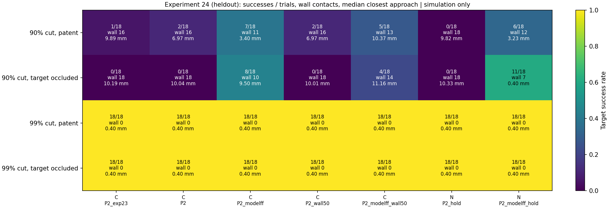

# Model feedforward, release hold and a short wall horizon (experiment 24)

Computational research and education only. This note compares control policies
in a toy Y-vessel with physiological parameters. It is not a device design, not
a safety claim and not clinical guidance.

## Why

Experiment 23 ([docs/16](16_delay_aware_control.md)) left three gaps:

1. **Pure NdFeB never acts.** A 100 µm sphere settles to the wall before the
   first frame arrives. The gravity hold waited for tracking, so it never
   engaged.
2. **90% flow reduction fails.** Feedback cannot oppose flow it only sees
   through delayed frames.
3. **Wall prediction regresses at 7.5 fps.** Its horizon τ_d = 183 ms made it
   over-conservative.

Claude chose the next step under a standing instruction from the user to
decide. The design and hypotheses below were written before the full run.

## New options (all off by default)

| Option | Meaning | Assumption |
|---|---|---|
| `gravity_hold_from_release` | Commands −W from release, before and without tracking | The weight and the gravity direction are known a priori |
| `estimator_knows_weight` | The command-aware estimator integrates command + W | Same as above |
| `model_flow_feedforward`, `flow_model_error` | Adds `−γ_model·u_model(x̂, t)` to the command; the estimator treats the same modeled flow as a known input and tracks only the residual | The controller has the same flow-field shape, occlusion and cardiac phase as the plant; only the mean speed is scaled by (1 + error). The random disturbance is not modeled |

**A flaw found in experiment 23.** The command-aware estimator treated a held
weight as commanded motion: the hold force read as a drift of W/γ. For the
composite particle that phantom drift is ~6 mm/s; for pure NdFeB it is
~40 mm/s. That is enough to push the estimate 2 mm off within 50 ms and keep
the gate closed. Experiment 23 is archived as run. Here every arm uses the
weight-aware estimator, except `C_P2_exp23`, which is experiment 23's P2
unchanged and so measures the fix.

The model feedforward also needed the estimator change. Without it, the
estimator reads the cancelling command as backward motion while the real
particle holds still.

## Arms

Every arm uses the command-aware estimator, the actuation-limited gain
`0.5·γ_model/T_a` (T_a = 10 ms, assumed) and a gravity hold.

| Arm | Material | Differences from C_P2 |
|---|---|---|
| C_P2_exp23 | composite | Weight-unaware estimator (= experiment 23 P2) |
| **C_P2** (composite baseline) | composite | — |
| C_P2_modelff | composite | + model flow feedforward |
| C_P2_wall50 | composite | + wall prediction with a fixed 50 ms horizon (assumed) |
| C_P2_modelff_wall50 | composite | + both |
| **N_P2_hold** (NdFeB baseline) | pure NdFeB | + hold from release |
| N_P2_modelff_hold | pure NdFeB | + hold from release + model flow feedforward |

The grid is 90% or 99% flow reduction × 7.5, 15 or 30 fps × patent or
occluded target × upper or lower branch.

- **Pilot:** seeds 0–2.
- **Held-out:** seeds 3–5. Conclusions use held-out results.
- **Flow-model error:** ±20% mean-speed mismatch on the held-out seeds, for
  the three model-feedforward arms. They are paired with their error-free
  baselines.

## Pre-registered hypotheses

- **H4:** The release hold lets pure NdFeB receive frames and reach patent
  targets at 99% reduction.
- **H5:** Model feedforward lifts 90% reduction above P2 (1/18 held-out in
  experiment 23) and survives ±20% flow-model error.
- **H6:** A 50 ms horizon removes the 7.5 fps wall-prediction regression and
  keeps its 90% benefit.

## Results

`python -m simulations.24_feedforward_and_hold` runs 1440 trials: pilot 504,
held-out 504 and flow-model error 432. It takes roughly 20–30 min on 8 cores; the pure NdFeB trials dominate.
Pilot and held-out agree. The numbers below are held-out.

| Hypothesis | Outcome (held-out) |
|---|---|
| H4: the release hold lets pure NdFeB reach patent targets at 99% | **Supported.** 18/18 patent and 18/18 occluded (95% Wilson [82%, 100%] each). In experiment 22, pure NdFeB was 0/432 |
| H5: model feedforward lifts 90% above P2 and survives ±20% flow-model error | **Half supported.** Error-free, it lifts 90% clearly (below). With ±20% error the benefit mostly disappears: occluded targets fall to 0/18 in every model-feedforward arm, and patent targets to 0–3/18 |
| H6: a 50 ms horizon removes the 7.5 fps regression and keeps the 90% benefit | **Half supported.** There are no regressions at 99% (18/18 in both target states, against 14/18 and 12/18 with the τ_d horizon in experiment 23). But it adds nothing at 90% (0 rescued), and combined with feedforward it does worse than feedforward alone |

Model feedforward at 90% reduction, held-out, paired with the material's baseline:

| Arm | Patent target | Occluded target |
|---|---|---|
| C_P2 (composite baseline) | 2/18 | 0/18 |
| C_P2_modelff | **7/18** (7 rescued, 2 regressed) | **8/18** (8 rescued, 0 regressed) |
| N_P2_hold (NdFeB baseline) | 0/18 | 0/18 |
| N_P2_modelff_hold | **6/18** (6 rescued) | **11/18** (11 rescued) |

**Frame rate decides the 90% cases.** With model feedforward, every 7.5 fps
cell fails (0/6 in each arm and target state). At 15 and 30 fps it succeeds in
3–6 of 6. Pure NdFeB reaches the occluded target in 6/6 at 30 fps and 5/6 at
15 fps. At 99% every arm succeeds at every frame rate.

**Weight-aware estimator.** Composite success is almost unchanged against the
experiment 23 estimator (C_P2 2/18 against C_P2_exp23 1/18 at 90% patent; all
18/18 at 99%). For pure NdFeB the fix is what lets the particle steer at all;
without it, the gate stays closed. `C_P2_exp23` reproduces experiment 23's P2
trial for trial, and the test suite checks that.

## Interpretation

- **Gravity is a solved sub-problem in this model.** Holding against gravity
  from release needs only a priori knowledge: the weight and the gravity
  direction. The imaging loop then starts from a particle that has not sunk.
  Pure NdFeB then does as well as the light composite at 99% reduction.
  Its 7× larger force cap leaves headroom at 90%. With model feedforward there,
  the composite's median peak force is 84% of its cap, while pure NdFeB uses
  13% of its cap.
- **At 90%, the limit is how well the flow is known.** With a correct flow
  model, feedforward removes most of the flow the delayed feedback could not
  oppose. A 20% mean-speed error leaves 12–17 mm/s of residual at the 90%
  centerline. The particle reaches the junction in ~0.15 s, about one or two
  frames, which is not enough time to learn that residual from images.
  Feedforward at 90% is therefore only as good as the flow measurement behind
  it, for example a Doppler or phase-contrast estimate; this model does not
  provide one.
- **The wall-prediction filter is not yet useful here.** With a short horizon
  it is harmless, and with the delay-length horizon it is harmful.

## Limitations

Everything in docs/15 and docs/16 applies. In addition:

- The controller's flow model has exactly the plant's shape, occlusion and
  cardiac phase, and differs only in scale. Shape, phase and pulsation-amplitude
  errors are untested, so the error-free rows are optimistic.
- The open-loop hold assumes the weight and the gravity direction are known
  exactly. Errors in patient orientation are untested.
- The estimator's command model uses Stokes drag. With pure NdFeB, commands can
  reach Re_slip ~10, where Schiller–Naumann drag is ~1.7× Stokes, so the
  predicted command motion is too large. This error is present in the NdFeB
  arms and not corrected.
- At 90% there are 18 trials per pooled cell. Differences of a few trials are
  within noise; the per-frame-rate pattern is clearer than the pooled rates.
