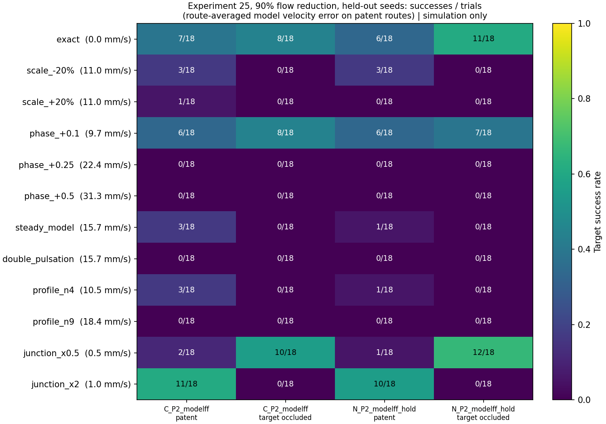
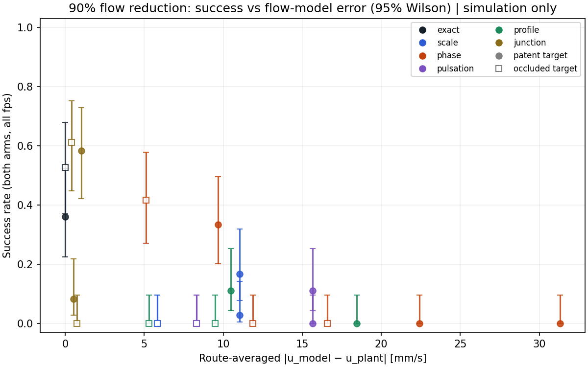

# How wrong can the flow model be? (experiment 25)

Computational research and education only. This note tests control policies in
a toy Y-vessel with physiological parameters. It is not a device design, not a
safety claim and not clinical guidance.

## Question

In experiment 24 ([docs/17](17_feedforward_and_hold.md)), model flow
feedforward made 90% proximal flow reduction workable. With a correct model,
occluded targets were reached in 8/18 (composite) and 11/18 (pure NdFeB)
trials. A ±20% error in mean speed removed most of that. A real flow model
can also be wrong in other ways: in cardiac timing, pulsation amplitude,
profile shape and the geometry of the flow split. **Which errors matter, and
is there one number that predicts the damage?**

## Design

The plant never changes; only the controller's copy of the flow model is
wrong. The arms are experiment 24's two model-feedforward arms: the composite
`C_P2_modelff` and the pure-NdFeB `N_P2_modelff_hold`. They run at 90% or 99%
reduction × 7.5, 15 or 30 fps × patent or occluded target × both branches ×
held-out seeds 3–5. This tests a fixed design, so nothing was tuned and no
pilot seeds were used. That gives 1728 trials; the command is
`python -m simulations.25_flow_model_errors`.

| Condition | Controller model | Kind |
|---|---|---|
| exact | Same as the plant | reference; must reproduce experiment 24 |
| scale ±20% | Mean speed × 0.8 or × 1.2 | scale (as in experiment 24) |
| phase +0.1, +0.25, +0.5 | Cardiac phase shifted by that fraction of the 1 s period (0.5 = anti-phase) | timing |
| steady model | Pulsation amplitude A = 0 | pulsation |
| double pulsation | A = 0.9 (plant 0.45) | pulsation |
| profile n4, n9 | Power-law profile `u_max(1 − (ρ/R)^n)`, same mean flux; centerline speed 1.5U and 1.22U against the plant's 2U | profile shape |
| junction ×0.5, ×2 | Transition length and branch width of the direction blend scaled | split geometry |

All magnitudes are **assumed**. They were chosen to span plausible errors,
not taken from measurement data.

**One number for every error.** For each condition, the route-averaged model
error is the mean of |u_model − u_plant|. The average runs over both target
routes (centerline and 0.5 mm off-axis in four directions) and one cardiac
period. It was computed before the trials were run.

| Condition | Route error at 90%, patent [mm/s] | Occluded [mm/s] |
|---|---:|---:|
| junction ×0.5 | 0.5 | 0.4 |
| junction ×2 | 1.0 | 0.7 |
| phase +0.1 | 9.7 | 5.1 |
| profile n4 | 10.5 | 5.3 |
| scale ±20% | 11.0 | 5.8 |
| steady model / double pulsation | 15.7 | 8.3 |
| profile n9 | 18.5 | 9.5 |
| phase +0.25 | 22.4 | 11.9 |
| phase +0.5 | 31.3 | 16.6 |

Occluded routes have smaller errors because the flow into a dead-end branch is
near zero in both models.

## Pre-registered hypotheses

- **H7:** A phase error of at most 0.1 period keeps at least half of the
  exact-model successes at 90%. Errors of 0.25 and 0.5 period lose most of them.
- **H8:** Blunter assumed profiles underestimate the centerline speed by 25%
  and 39%, so they lose most of the benefit, like a scale error of similar size.
- **H9:** A steady model (A = 0) keeps fewer than half of the exact-model
  successes.
- **H10:** At 90%, success falls with the route-averaged error. Conditions above
  ~10 mm/s (the ±20% scale error) lose most of the benefit.
- At 99% reduction, every condition stays at 18/18.

## Results

The exact condition reproduces experiment 24 trial for trial, and the test
suite checks that. At **99% reduction every condition reaches 72/72**, so
flow-model errors do not matter there. Everything below is at 90%, as
held-out successes out of 18 trials per cell (3 frame rates × 2 branches ×
3 seeds).

| Condition | Route error [mm/s] | Composite patent | Composite occluded | NdFeB patent | NdFeB occluded | Total /72 |
|---|---:|---:|---:|---:|---:|---:|
| exact | 0 | 7 | 8 | 6 | 11 | **32** |
| junction ×0.5 | 0.5 | 2 | 10 | 1 | 12 | 25 |
| junction ×2 | 1.0 | 11 | **0** | 10 | **0** | 21 |
| phase +0.1 | 9.7 | 6 | 8 | 6 | 7 | **27** |
| profile n4 | 10.5 | 3 | 0 | 1 | 0 | 4 |
| scale −20% | 11.0 | 3 | 0 | 3 | 0 | 6 |
| scale +20% | 11.0 | 1 | 0 | 0 | 0 | 1 |
| steady model | 15.7 | 3 | 0 | 1 | 0 | 4 |
| double pulsation | 15.7 | 0 | 0 | 0 | 0 | 0 |
| profile n9 | 18.5 | 0 | 0 | 0 | 0 | 0 |
| phase +0.25 | 22.4 | 0 | 0 | 0 | 0 | 0 |
| phase +0.5 | 31.3 | 0 | 0 | 0 | 0 | 0 |

| Hypothesis | Outcome |
|---|---|
| H7: phase ≤ 0.1 period keeps ≥ half; 0.25 and 0.5 lose most | **Supported.** +0.1 keeps 27/72 against 32/72 exact; +0.25 and +0.5 give 0/72 |
| H8: blunter profiles lose most | **Supported.** n4 gives 4/72 and n9 gives 0/72 |
| H9: a steady model keeps fewer than half | **Supported.** 4/72; doubling the pulsation gives 0/72 |
| H10: success falls with route-averaged error, and above ~10 mm/s most is lost | **Not supported as a single predictor.** It holds within the scale, phase, pulsation and profile errors. Junction errors break it, and so does phase +0.1 against scale errors of similar size (below) |
| 99% stays at 18/18 per cell | **Supported.** 72/72 for every condition |

### What the route error does not capture

1. **Errors at the split can move outcomes in either direction.** Junction
   errors are the smallest by route average (0.5–1.0 mm/s). Averaged over the
   junction region alone they are still only 1.8–3.2 mm/s, against 8.1 mm/s
   for a +20% scale error; this measure was computed after the fact.
   - Scaling the model's transition length and branch width by 2 raises patent
     successes from 13/36 to 21/36 and drops occluded ones from 19/36 to
     **0/36**.
   - Scaling them by 0.5 does roughly the opposite: patent 3/36, occluded 22/36.

   The sign of the error at the split decides which way the particle is
   pushed, so the model's flow shape there matters more than its magnitude.
2. **A small phase error is gentler than a scale error of the same size.**
   On occluded routes, phase +0.1 (5.1 mm/s) keeps 15/36. Profile n4 (5.3 mm/s)
   and a ±20% scale error (5.8 mm/s) keep none. A plausible reading, also after
   the fact, is that a small phase error alternates in sign and partly
   averages out over the transit, while scale and profile errors push the same
   way the whole time.

## Interpretation

- **At 90% the experiment 24 result sits on a knife edge.** Even the exact
  model succeeds in fewer than half the trials, and perturbations too small to
  matter by any average can raise or lower the rate by a factor of two or
  more. The rates in docs/17 are conditional on the model matching the plant
  at the split, and they should be read as fragile.
- **Some errors are tolerable and some are not.** Cardiac timing within ~0.1
  period (100 ms at 60 bpm) is tolerable. A persistent bias in speed or
  profile of 20–25% at the centerline is not, and neither is a wrong
  pulsation amplitude. Any error in where the streamlines turn at the split can
  flip outcomes.
- **For a real system,** feedforward at 90% would need the local flow field at
  the bifurcation, not just a mean speed. That points to measuring flow at the
  split itself, for example by phase-contrast or Doppler, rather than using a
  vessel-level estimate. Nothing in this repository models such a measurement.
- **At 99% reduction none of this matters.** Feedback alone handles the flow,
  which remains the robust operating point in this model.

## Limitations

Everything in docs/15–17 applies. In addition:

- Each error type is tested alone. Real errors combine.
- The plant is itself the same idealized field, so "exact" means exact with
  respect to a toy flow, not to real hemodynamics. The junction result in
  particular shows that details of the toy direction blend affect outcomes.
- 36 trials per condition and target type at 90%. Differences of a few trials
  are within noise.
