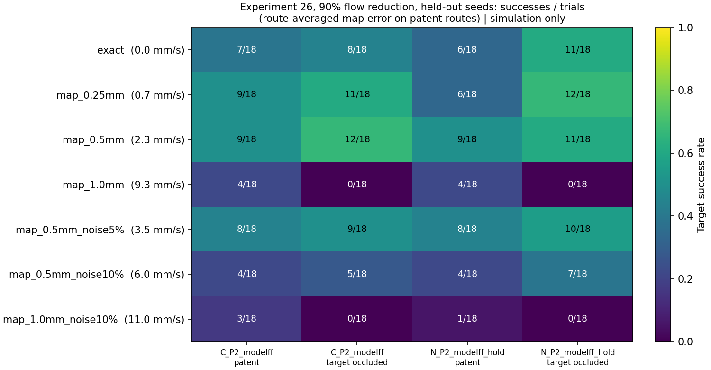

# Feedforward from a measured flow map (experiment 26)

Computational research and education only. This note tests control policies in
a toy Y-vessel with physiological parameters. It is not a device design, not a
safety claim and not clinical guidance.

## Question

Experiment 25 ([docs/18](18_flow_model_errors.md)) showed that model
feedforward at 90% proximal flow reduction depends on the flow shape at the
split. A mean-speed estimate is not enough. The natural source for a local
flow field is an image-based measurement such as 4D flow MRI. That kind of
measurement has finite voxels, which blur the profile and the split, and
velocity noise. **How fine and how clean must such a map be to keep the
feedforward benefit?**

Claude chose this step under the standing instruction to keep going.

## Model (`src/flow_map.py`)

The controller's flow model is the plant's time-mean field sampled on a
regular voxel grid over the vessel's bounding box, then interpolated
trilinearly.

- The pulsation waveform and cardiac phase are taken as exact, as if the
  measurement were ECG-gated. Experiment 25 covers timing errors separately.
- Each lumen voxel gets fixed Gaussian noise per velocity component, with σ a
  fraction of the centerline mean speed. The noise is drawn once per trial from
  its own random stream, so the sensor and flow draws are unchanged.
- Voxels near the wall and the split mix lumen and wall values (partial volume).
  At 1.0 mm this underestimates the parent centerline speed by about 21%.

The voxel sizes and noise levels are **assumed**, chosen to span a plausible
range, not taken from a scanner specification.

| Condition | Voxel | Noise σ | Route error, 90% patent [mm/s] | Occluded [mm/s] |
|---|---:|---:|---:|---:|
| exact (analytic model) | — | — | 0 | 0 |
| map_0.25mm | 0.25 mm | 0 | 0.7 | 0.4 |
| map_0.5mm | 0.5 mm | 0 | 2.3 | 1.2 |
| map_0.5mm_noise5% | 0.5 mm | 5% | 3.6 | 3.1 |
| map_0.5mm_noise10% | 0.5 mm | 10% | 6.0 | 5.7 |
| map_1.0mm | 1.0 mm | 0 | 9.3 | 5.3 |
| map_1.0mm_noise10% | 1.0 mm | 10% | 11.0 | 9.1 |

The route error is the mean |u_map − u_plant| along both routes over one
cardiac period, using the seed-3 noise draw; it is computed as in docs/18.

## Design

The arms and seeds match experiment 25: `C_P2_modelff` (composite) and
`N_P2_modelff_hold` (pure NdFeB), on held-out seeds 3–5. Every condition runs
at 90% reduction × 7.5, 15 or 30 fps × patent or occluded target × both
branches. At 99%, only the exact model and the worst map run. That gives 648
trials; the command is `python -m simulations.26_measured_flow_map`.

## Pre-registered hypotheses

- **H11:** A noiseless 0.25 mm map keeps at least 80% of the exact-model
  successes at 90%.
- **H12:** Success falls with voxel size. A 1.0 mm map, which blurs the
  1.5 mm-radius profile and the split, loses most of the benefit.
- **H13:** 5% noise at 0.5 mm costs little, because the noise is zero-mean and
  varies from voxel to voxel. 10% costs more but keeps some benefit.
- At 99%, the worst map stays at 18/18 per cell.

## Results

The exact condition reproduces experiment 25 trial for trial. At **99%
reduction the worst map (1.0 mm, 10% noise) still gives 72/72**. The table
covers 90% reduction: held-out successes out of 18 per cell, then the pooled
total with its 95% Wilson interval, then the trial-by-trial comparison with
the exact model.

| Condition | Route error [mm/s] | Composite patent | Composite occluded | NdFeB patent | NdFeB occluded | Total /72 [95% CI] | Kept / lost / gained vs exact |
|---|---:|---:|---:|---:|---:|---|---|
| exact | 0 | 7 | 8 | 6 | 11 | 32 [34%, 56%] | — |
| map 0.25 mm | 0.7 | 9 | 11 | 6 | 12 | **38** [41%, 64%] | 32 / **0** / 6 |
| map 0.5 mm | 2.3 | 9 | 12 | 9 | 11 | **41** [45%, 68%] | 30 / 2 / 11 |
| map 0.5 mm, 5% noise | 3.6 | 8 | 9 | 8 | 10 | 35 [37%, 60%] | 24 / 8 / 11 |
| map 0.5 mm, 10% noise | 6.0 | 4 | 5 | 4 | 7 | 20 [19%, 39%] | 12 / 20 / 8 |
| map 1.0 mm | 9.3 | 4 | 0 | 4 | 0 | 8 [6%, 20%] | 6 / 26 / 2 |
| map 1.0 mm, 10% noise | 11.0 | 3 | 0 | 1 | 0 | 4 [2%, 13%] | 1 / 31 / 3 |

| Hypothesis | Outcome |
|---|---|
| H11: a noiseless 0.25 mm map keeps ≥ 80% of the exact successes | **Supported.** It keeps every exact success (0 lost) and gains 6, for 38/72 |
| H12: success falls with voxel size; 1.0 mm loses most | **Supported at 1.0 mm** (8/72; occluded targets 0/36). Between 0.25 and 0.5 mm there is no decline: 38 and 41 |
| H13: 5% noise costs little, 10% costs more but keeps some | **Supported.** 35/72 with 5% noise; 20/72 with 10% noise, about 60% of the exact total |
| 99% stays at 18/18 per cell | **Supported.** 72/72 with the worst map |

Frame rate is still a hard floor. Every condition gets 0 successes at 7.5 fps;
all successes come at 15 and 30 fps.

### Maps that beat the exact model

The 0.25 mm and 0.5 mm maps do slightly better than the exact analytic model:
38 and 41 successes against 32, with overlapping intervals. The 0.25 mm map
never loses an exact success. This does not mean a blurred map is a better
model. Experiment 25 showed that, at 90% reduction, small changes in the
modeled flow near the split and the walls can move outcomes either way.
Partial-volume smoothing is one such change, and here it happens to help. The
explanation is offered after the fact and was not tested separately.

## Interpretation

- **In this model, a map of about 0.5 mm or finer is enough.** With noise at
  or below ~5% of the centerline speed, it keeps the full feedforward benefit
  at 90% reduction. At 1.0 mm the map blurs a 1.5 mm-radius vessel and its
  split too much, and occluded targets are lost entirely. Noise near 10%
  halves the benefit.
- **Only the local field needs to be right.** A voxelized, noisy map with the
  right local shape works, while the exact field with a 20% speed bias
  (docs/18) does not. What matters is local shape at the split, not a
  vessel-level summary.
- **Measurement is not the same as control.** Whether a real 4D flow
  acquisition at M1 reaches ~0.5 mm with ~5% noise, and stays valid while a
  device is operating, is outside this model. The thresholds here are
  conditional on the toy geometry and the idealized flow.

## Limitations

Everything in docs/15–18 applies. In addition:

- The map is taken of the same idealized plant field, so the only
  measurement errors are resolution and noise. There is no misregistration,
  no velocity-encoding aliasing and no change in flow after the measurement.
- The noise is white and independent per voxel. Spatially correlated noise
  would act more like the biased errors of docs/18.
- One noise realization per trial seed; there are 72 trials per condition at 90%.
